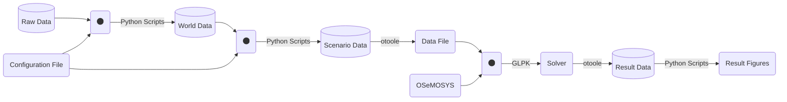

# Contributing to OSeMOSYS Global

Thank you for contributing to OSeMOSYS Global! The following information will help make contributing easy for everyone involved.

### Table Of Contents

[How do I ask a question?](#how-do-i-ask-a-question)

[comment]: <[Code of Conduct](#code-of-conduct)> (After Code of Conduct is added) 

[What should I know before I get started?](#what-should-i-know-before-i-get-started)

* [Workflow logic](#workflow-logic)
* [Directory Structure](#directory-structure)

[How Can I Contribute?](#how-can-i-contribute)

* [Questions and Discussions](#questions-and-discussions)
* [Issues](#issues)
* [Suggestions](#suggestions)
* [Pull Requests](#pull-requests)

[Styleguide](#styleguide)

## How do I ask a question?

For general questions, please use the discussions tab on the repository.

[comment]: <## Code of Conduct>
[comment]: <Before contributing in any way, please review our code of conduct document.>

## What should I know before I get started?

OSeMOSYS Global follows utilizes [Snakemake](https://snakemake.readthedocs.io/en/stable/)
to manage its configurable workflow. Before contributing, please review the
summary of the workflow and directory structure shown below.

### Workflow Logic

Below is a simplified diagram highlighting the main componenets of the
workflow. Each of the processed database objects (World, Scenario, and Results)
represent a folder of CSVs that the user can filter through for themselves. A
full diagram of the workflow, showing the dependencies of each python script,
can be found [here](https://github.com/OSeMOSYS/osemosys_global/blob/master/docs/dag.pdf).



### Directory Structure

The structure of the directory follows the recommended [snakemake directory structure](https://snakemake.readthedocs.io/en/stable/snakefiles/deployment.html).
The figure below highlights how structure and where contributors can look for
information.

``` bash
osemosys_global
├── config                        # User configurable setup files
│   ├── config.yaml               
├── resources                     # Raw Data and OSeMOSYS File 
├── resutls                       # Will appear after running 
│   ├── data                      # World Data
│   ├── figs                      # Global demand projection figures 
│   ├── scenario_name             # Repeted folder for each scenario run
│   │   ├── data/                 # Scenario input CSV data
│   │   ├── figures/              # Scenario result figures
│   │   ├── results/              # Scenario result CSV data
│   │   ├── scenario_name.txt     # Scenario data file
├── workflow                      # All tools for the workflow
│   ├── envs                      # Conda environemnts
│   ├── notebooks                 # Jupyter Notebooks
│   ├── rules                     # snakemake modules
│   ├── scripts                   # Data processing scripts
│   ├── snakefile                 # callable snakefile                   
```

## How can I Contribute?

We encourage all users to contribute to OSeMOSYS Global! There are four main
options to contribute to the project, each of which are highlighted below.

### Questions and Discussions

If you have general questions or comments on the project, plese submit them
to our community discussion board. Maintainers and community collaborators
will respond in the thread to ensure communication stays open and available
for future reference.

### Issues

As with any project, OSeMOSYS Global is continually evolving and has bugs. If
you encounter a bug, please don't ignore it! Instead, submit an [issue](https://github.com/OSeMOSYS/osemosys_global/issues/new/choose)
to our repository so we can solve the problem. There are three types of issue
templates available to help categorize issues:

* Bug Report - Issues relating to code/workflow errors
* Data - Issues relating to missing or incorrect data
* Documentation - Issues relating to missing/incorrect/old documentation

After selecting a template, fill out all requred fields and submit the issue.
Maintainers and contributors will respond in the thread.

### Suggestions

If you want to use OSeMOSYS Global for your project or research, but it is
missing some functionality, we want to know! Expanding OSeMOSYS Global to
more effectively help researchers is a big goal of this project. To submit a
suggestion for future imporvments, please submit a [Feature Request](https://github.com/OSeMOSYS/osemosys_global/issues/new/choose)
issue.

### Pull Requests

Pull requests are code submissions to be added to a feature branch in the
project. Please follow the steps below to submit an effective pull request. If
you do not follow the steps below, your pull request may be denied.

1. Identify an issue you want to fix
    * If the issue already exists, assign your name to the issue ticket
    * If the issue does not exist, submit a new issue ticket following the
    instruictions in the [issues section](#issues) and assign your name to it.
    
2. Fork the `osemosys_global` repository

3. Clone the forked repository

    ```bash 
    (base) ~/repositories$ git checkout https://github.com/<github_username>/OSeMOSYS/osemosys_global.git
    ```

4. Install or activate the `osemosys-global` conda environment 

    To install the environment...
    ```bash
    (base) ~/osemosys_global$ conda env create -f workflow/envs/osemosys-global.yaml    
    ```
    
    To activate the environment if already installed...
    ```bash
    (base) ~/osemosys_global$ conda activate osemosys-global    
    ```

5. Checkout the `master` branch and pull in the latest changes

    ```bash
    (osemosys-global) ~/osemosys_global$ git checkout master
    (osemosys-global) ~/osemosys_global$ git pull
    ```

6. Create a new branch with a name in the form of `issue-###` where `###` is
the autoassigned issue number from GitHub.

    ```bash
    (osemosys-global) ~/osemosys_global$ git checkout -b issue-110
    ```

7. Make the code changes to fix the issue.
8. Commit and push the changes to the remote repository

    ```bash
    (osemosys-global) ~/osemosys_global$ git add <file_name>
    (osemosys-global) ~/osemosys_global$ git commit -m 'descripitve commit message'
    (osemosys-global) ~/osemosys_global$ git push
    ```

9. Launch a new [pull request](https://github.com/OSeMOSYS/osemosys_global/pulls)
on the repository. You will see a template to fill out to capture all details
of your pull request.

## Styleguide

All submitted code is linted using [pylint](https://pylint.org/) using the
`.pylintrc` file found in `.github/linters`. In general, we follow the
open-source standards outlined by Google in their Python [syleguide](https://google.github.io/styleguide/pyguide.html).
The one noteable acception of checking for a line length of 90 charachters
instead of 80 charachters.
