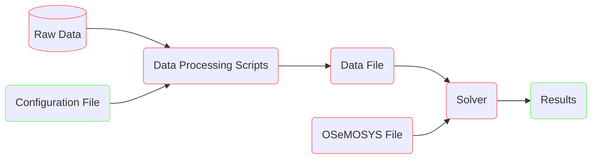

# OSeMOSYS global

OSeMOSYS Global is an open-source, open-data model generator for creating
global energy system models. It can be used to create inter-connected energy
systems models for both the entire globe and for any geographically diverse
subset of the globe. Compared to other existing global models, OSeMOSYS Global
creates a full energy system representation, allows for full user flexibility
in determining the modelling detail and geographic scope, and is built using
the fully open-source [OSeMOSYS](https://osemosys.readthedocs.io/en/latest/)
energy system model.

## Table of Contents

- [Documentation](#documentation)
- [Installation](#installation)
- [Getting Started](#getting-started)
- [Contributing](#contributing)
- [Support + Feedback](#support--feedback)
- [Dependencies](#dependencies)
- [License](#license)
- [Citing](#citing)

## Documentation

TBD

## Installation

1. Install [GLPK](https://www.gnu.org/software/glpk/)
2. Install [CBC](https://github.com/coin-or/Cbc)
3. Install [miniconda](https://docs.conda.io/en/latest/miniconda.html)
4. Clone the git repository.

   ```bash
    ~/osemosys_global$ git clone --recurse-submodules https://github.com/OSeMOSYS/osemosys_global.git 
    ```

    If the repository was cloned without the `--recurse-submodules` flag, run
    the commands

    ```bash
    ~/osemosys_global$ git submodule init
    ~/osemosys_global$ git submodule update 
    ```

5. Create a conda environment from the supplied environment file

    ```bash
    (base) ~/osemosys_global$ conda env create -f workflow/envs/osemosys-global.yaml    
    ```

6. Activate the new `osemosys-global` environment

    ```bash
    (base) ~/osemosys_global$ conda activate osemosys-global
    ```

    ```bash
    (osemosys-global) ~/osemosys_global$ 
    ```

### Troubleshooting

1. Verify that GLPK is installed by running the command `glpsol`.

    ```bash
    (osemosys-global) ~/osemosys_global$ glpsol
    ```

    ```bash
    GLPSOL: GLPK LP/MIP Solver, v4.65
    No input problem file specified; try glpsol --help
    ```

2. Verify that CBC is installed by running the command `cbc`

    ```bash
    (osemosys-global) ~/osemosys_global$ cbc
    ```

    ```bash
    Welcome to the CBC MILP Solver 
    Version: 2.10.3 
    Build Date: Mar 24 2020 

    CoinSolver takes input from arguments ( - switches to stdin)
    Enter ? for list of commands or help
    Coin:
    ```

    Quit the solver with the command `quit`

3. Verify that Conda is installed by running the command `conda info`

    ```bash
    (osemosys-global) ~/osemosys_global$ conda info
    ```

## Getting Started

### Flowchart

A high level overview of OSeMOSYS Global is shown below. The green boxes
highlight where the user interfaces with the model. The red boxes highlight
automated actions that run behind the scenes.



### Directory Structure

The main components of the directory that the user will interface with are
highlighted below. It follows the recommended [snakemake directory structure](https://snakemake.readthedocs.io/en/stable/snakefiles/deployment.html).

``` bash
osemosys_global
├── config                        # User configurable setup files
│   ├── config.yaml               
├── resources                      
├── resutls                       # Will appear after running 
│   ├── data                      
│   ├── figs                      # Global demand projection figures 
│   ├── scenario_name             # Repeted folder for each scenario run
│   │   ├── data/                 # Scenario input CSV data
│   │   ├── figures/              # Scenario result figures
│   │   ├── results/              # Scenario result CSV data
│   │   ├── scenario_name.txt     # Scenario data file
├── workflow                         
└── ...
```

### Configuration File

Numerous parameters have been exposed to the user to control the model. These
parameters are stored in the `osemosys_global/config/config.yaml`
[file](https://github.com/OSeMOSYS/osemosys_global/tree/master/config).

### Examples

#### Run the Workflow with Default Settings

1. Run the command `snakemake -c`

    ```bash
    (osemosys-global) ~/osemosys_global$ snakemake -c
    ```

2. View system level results in the `results/India/figures` folder

#### Run a scenario for Bangladesh, Bhutan, India, and Nepal (BBIN) with trade and an emission penalty of $25/Tonne

1. Change the scenario name in `config/config.yaml`

    ```bash
    scenario: 'BBIN'
    ```

2. Change the geographic scope in `config/config.yaml`

    ```bash
    geographic_scope:
    - 'IND'
    - 'BGD'
    - 'BTN'
    - 'NPL'
    ```

3. Update the `crossborderTrade` parameter in `config/config.yaml`

    ```bash
    crossborderTrade: True
    ```

4. Change the emission penalty in `config/config.yaml`

    ```bash
    emission_penalty: 25 
    ```

5. Run the command `snakemake -c`

    ```bash
    (osemosys-global) ~/osemosys_global$ snakemake -c
    ```

6. View system level and country results in the `results/BBIN/figures` folder

#### Run a World scenario from 2020 to 2040 graphing results at a system level only

1. Change the scenario name in `config/config.yaml`

    ```bash
    scenario: 'WORLD'
    ```

2. Delete everything under the geographic scope in `config/config.yaml`

    ```bash
    geographic_scope:
    ```

3. Change the startYear and endYear parameters in `config/config.yaml`

    ```bash
    startYear: 2020
    endYear: 2040
    ```

4. Set the results to only graph at a system level in `config/config.yaml`

    ```bash
    results_by_country: False
    ```

5. Run the command `snakemake -c` 
**(This scenarion will take ~20hrs to run on a high performance computer with CPLEX)**

    ```bash
    (osemosys-global) ~/osemosys_global$ snakemake -c
    ```

6. View system level results in the `results/WORLD/figures` folder

## Contributing

We appreciate feedback and contribution to this repo! Please see our
[contribution guide](CONTRIBUTING.md) for information on how to conribute.

## Support + Feedback

We encourage community memebers to ask questions and report any issues they
encounter.

- For asking general usage questions, please use the [commuity fourm]
(https://github.com/OSeMOSYS/osemosys_global/discussions/categories/q-a).
- For reporting code and data issues, please use the appropiate [issue template]
(https://github.com/OSeMOSYS/osemosys_global/issues/new/choose)

## Dependencies

OSeMOSYS Global relies on numerous open-source community supported tools.
Below is a list on the heavily used packages that we hope you investigate
further for yourself!

- [Python](https://www.python.org/downloads/) is used for all data processing
- [Anaconda](https://docs.conda.io/projects/conda/en/latest/) and
[Miniconda](https://docs.conda.io/en/latest/miniconda.html) are used to manage
Python packages
- [Snakemake](https://snakemake.readthedocs.io/en/stable/) is a Python based
workflow management tool
- [otoole](https://github.com/OSeMOSYS/otoole) is a Python based command line
interface used generate OSeMOSYS input and output datafiles
- [Pandas](https://pandas.pydata.org/) is a Python package used to transform
and analyze data
- [Plotly](https://plotly.com/) is a Python package for data visualization
- [GLPK](https://www.gnu.org/software/glpk/) is used to create linear programming
data files
- [CBC](https://github.com/coin-or/Cbc) is a linear programming and mixed integer
program solver

## License

OSeMOSYS Global is liscenced under a MIT liscence. Please see our [LICENSE](LICENSE)
doc for more information.

## Citing

TBD
