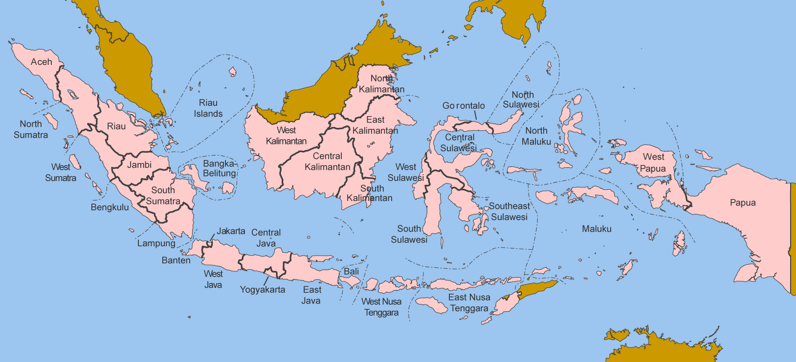

Indonesia
=========

The first application of FEO Global is the development of an openly available 
electricity systems model for Indonesia. This model is used to explore 
transition pathways to a net-zero electricity system. As with all energy system 
models, the inputs include a range of datasets and assumptions (e.g. technology 
cost projections, discount rates). All of these inputs are described here in 
order to allow for the model to be reviewed, re-run, and re-purposed.

Model scope
-----------
The model aims to represent the electricity system of Indonesia as accurately as
possible, subject to constraints on data and computation time. The main aspects 
that improve the accuracy of the model's representation of Indonesia's 
electricity system are its spatial and temporal resolution.

Spatial resolution
..................

The model represents all 34 provinces of Indonesia across 7 regions - shown in 
the table and map below - as individual nodes. 

.. csv-table:: Provinces of Indonesia
   :file: tables/provinces.csv
   :widths: 50, 50, 50, 50
   :header-rows: 1
   :align: center

Temporal resolution
...................
Each year is divided into 6 'Seasons' [S1-S6]: 

.. csv-table:: Teporal resolution - Seasons
   :file: tables/seasons_summary.csv
   :widths: 50, 50
   :header-rows: 1
   :align: center

Each 'Season' is further divided into 12 'Daily Time Brackets':

.. csv-table:: Temporal resolution - daily time brackets
   :file: tables/dailytimebrackets_summary.csv
   :widths: 50, 50
   :header-rows: 1
   :align: center

Together, there are 72 representative 'timeslices' in the model. The temporal 
resolution is the same for the entire model period. 

Model horizon
.............
Base year - 2021

End year - 2050

Key assumptions
---------------

Discount rates
..............
The model includes two types of discount rates (DR): 'social' and 'financial'. 
The social DR is applied across the entire model and represents the relative 
weighting of present and future costs and benefits. A low social DR weights the 
present and the future more similarly than a high DR. The financial DR is 
technology-specific and represents the weighted average cost of capital (WACC) 
for a given technology (e.g. power plant). The model assumes a value of 
**10%** for both the social and financial discount rates. The latter is based 
on the `IEA Cost of Capital Observatory <iea_wacc_>`_ 

.. _iea_wacc: https://www.iea.org/data-and-statistics/data-tools/cost-of-capital-observatory

Reserve Margin
..............

- Reserve margin 60% -> 35%
- 

Data
----

Technology costs
................

`NREL <https://www.nrel.gov/docs/fy21osti/79236.pdf>`_ 

.. csv-table:: Technology cost projections (Capital)
   :file: tables/technology_costs_capital.csv
   :widths: 75, 50, 50, 50, 50, 50
   :header-rows: 1
   :align: center

.. csv-table:: Technology cost projections (Fixed)
   :file: tables/technology_costs_fixed.csv
   :widths: 75, 50, 50, 50, 50, 50
   :header-rows: 1
   :align: center

Renewable Energy Profiles
.........................

Hourly renewable energy profiles for wind (onshore and offshore) and solar PV were 
obtained from `renewables.ninja`_. Data for 2020 was used.

.. _renewables.ninja: https://www.renewables.ninja/

Renewable Energy Potentials
...........................

Data on renewable energy potentials by province was obtained from multiple 
sources:

- Geothermal: `'Volcanostratigraphy of Batukuwung-Parakasak Geothermal \
  Area, Serang Regency, West Java', U. Sumotarto, 2019 <geo_potential_>`_ 
- Solar PV: `'Beyond 443 GW - Indonesia's Infinite Renewable Energy Potentials', IESR, 2021 <beyond443gw_>`_
- Wind: `'Beyond 443 GW - Indonesia's Infinite Renewable Energy Potentials', IESR, 2021 <beyond443gw_>`_
- Biomass: `'Beyond 443 GW - Indonesia's Infinite Renewable Energy Potentials', IESR, 2021 <beyond443gw_>`_
- Hydropower: `International Hydropower Association, 2019 <hyd_potential_>`_

.. csv-table:: Renewable energy potential
   :file: tables/re_potentials_summary.csv
   :widths: 75, 50, 50, 50, 50, 50
   :header-rows: 1
   :align: center

Electricity demand projections
..............................

Electricity demands for all 34 provinces, current and projected, are inputs to 
the model. Electricity demand by province for 2021 is obtained from the 
`RUPTL 2021-2030 <ruptl_2021-2030_>`_. The methodology used to project these 
demands between 2021-2050 is detailed here_ and summarised below.

.. csv-table:: Electricity demand projections (GWh)
   :file: tables/demand_projections.csv
   :widths: 75, 75, 50, 50, 50, 50, 50
   :header-rows: 1
   :align: center

.. _here: https://docs.google.com/spreadsheets/d/1P9va-0Nhl3Tfr68iV4I5B9J3yA1qSakN/edit?usp=sharing&ouid=100957394761881350527&rtpof=true&sd=true

Fuel Prices
...........

.. csv-table:: Fuel price projections
   :file: tables/fuel_prices.csv
   :widths: 75, 75, 50, 50, 50, 50
   :header-rows: 1

Electricity interconnectors
...........................

Scenarios
---------

The model was used to explore three scenarios: *Current Policies [CP]*, 
*Least-cost [LC]*, and *Net-Zero [NZ]*. The scenarios represent alternate 
pathways for the expansion of Indonesia's electricity system. Each scenario 
consists of a set of assumptions and constraints, as detailed below:

Current policies
................

This scenario includes all implemented policies related to the expansion of 
Indonesia's electricity system as well as committed power plants. 
The policies included are: 

And the power plants included are:

Least-cost
..........

This represents an 'unconstrained' development of the electricity system. It 
does not include any emission or renewable energy targets. Planned powerplants 
are provided as 'options' to invest in but are not forced into the model. 

Net-zero
........

This scenario includes an explicit target of reaching net-zero emissions by 
2050, with peak emissions in 2040.

Results
-------

Capacity expansion
..................

.. raw:: html
   :file: figures/TotalCapacityAnnual_BAU.html

Annual electricity generation mix
.................................

.. raw:: html
   :file: figures/GenerationAnnual_BAU.html

Hourly electricity generation mix
.................................

.. raw:: html
   :file: figures/GenerationHourly_BAU.html

Planned improvements
--------------------

* Plant-specific efficiencies
* Hydropower capacity factor by plant / node
* Technology-specific discount rates
* Multiple weather years
* Province-specific demand profiles
* 

Model code, data, and workflow
------------------------------

The entire workflow of FEO Global is available on GitHub under an open license 
(AGPL v3.0) at `transition-zero/feo-esmod-osemosys <feo_repo_>`_. 
In addition, it uses only publicly available data and an open source solver 
(CBC). 

.. _feo_repo: https://github.com/transition-zero/feo-esmod-osemosys

References
----------

* `'An Energy Sector Roadmap to Net Zero Emissions in Indonesia', IEA, 2022 <iea_nze>`_
* `'Indonesia Energy Transition Outlook', IRENA, 2022 <irena_nze_>`_
* `'RUPTL 2021-2030', PLN, 2021 <ruptl_2021-2030_>`_
* `'Beyond 443 GW - Indonesia's Infinite Renewable Energy Potentials', IESR, 2021 <beyond443gw_>`_
* `'Indonesia Long-Term Strategy for Low Carbon and Climate Resilience 2050' <lts-lccr_>`_  

.. _irena_nze: https://www.irena.org/-/media/Files/IRENA/Agency/Publication/2022/Oct/IRENA_Indonesia_energy_transition_outlook_2022.pdf?rev=b122956e990f485994b9e9d7075f696c
.. _iea_nze: https://iea.blob.core.windows.net/assets/b496b141-8c3b-47fc-adb2-90740eb0b3b8/AnEnergySectorRoadmaptoNetZeroEmissionsinIndonesia.pdf
.. _ruptl_2021-2030: https://web.pln.co.id/statics/uploads/2021/10/ruptl-2021-2030.pdf
.. _beyond443gw: https://iesr.or.id/en/pustaka/beyond-443-gw-indonesias-infinite-renewable-energy-potentials
.. _lts-lccr: https://unfccc.int/sites/default/files/resource/Indonesia_LTS-LCCR_2021.pdf
.. _geo_potential: https://iopscience.iop.org/article/10.1088/1742-6596/1363/1/012048
.. _hyd_potential: https://www.hydropower.org/blog/indonesia-promotes-hydropower-to-create-the-demand-for-industrial-development#:~:text=The%20biggest%20hydropower%20potential%20is,Tenggara%2DMaluku%20is%201.1%20GW.