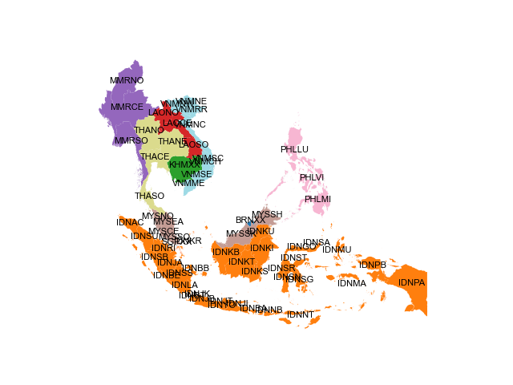

# ASEAN

This model is used to explore the potential benefits of the ASEAN Power Grid -
a set of proposed cross-border electricity interconnectors between the 10 ASEAN 
Member States (AMS). As with all energy system models, the inputs include a 
range of datasets and assumptions (e.g. technology cost projections, discount 
rates). All of these inputs are described here in order to allow for the model 
to be reviewed, re-run, and re-purposed.

## Model scope

The model aims to represent the electricity systems of AMS as accurately as
possible, subject to constraints on data and computation time. The main aspects 
that improve the accuracy of the model's representation of AMS' 
electricity systems are their spatial and temporal resolution.

### Spatial resolution

The model represents all AMS as individually, with Vietnam, Thailand, Indonesia, 
Malaysia, and the Philippines at a sub-national level and the remaining five AMS
at the national level. This is shown in the table and map below. 

** AMS regional definitions  **

{{ read_csv('./tables/asean_nodes.csv') }}

### Temporal resolution

Each year is divided into 2 'Seasons' [S1-S6]: 

{{ read_csv('./tables/seasons_summary.csv') }}

Each 'Season' is further divided into 6 'Daily Time Brackets':

{{ read_csv('./tables/dailytimebrackets_summary.csv') }}

Together, there are 12 representative 'timeslices' in the model. The temporal 
resolution is the same for the entire model period. 

### Model horizon

**Base year** - 2021

**End year** - 2050

## Key assumptions

### Discount rates

The model includes two types of discount rates (DR): 'social' and 'financial'. 
The social DR is applied across the entire model and represents the relative 
weighting of present and future costs and benefits. A low social DR weights the 
present and the future more similarly than a high DR. The financial DR is 
technology-specific and represents the weighted average cost of capital (WACC) 
for a given technology (e.g. power plant). The model assumes a value of 
**10%** for both the social and financial discount rates. The latter is based 
on the [IEA Cost of Capital Observatory](https://www.iea.org/data-and-statistics/data-tools/cost-of-capital-observatory). 

## Data

Below is a summary of all the input data used in the model.

### Technology costs

Battery costs from [NREL](https://www.nrel.gov/docs/fy21osti/79236.pdf). 
All other costs from [OSeMOSYS Global](https://www.nature.com/articles/s41597-022-01737-0)
and [PLEXOS World](https://dataverse.harvard.edu/dataverse/PLEXOS-World).

**Technology cost projections (Capital)**

{{  read_csv('./tables/technology_costs_capital_asean.csv')  }}

### Renewable Energy Profiles

Hourly renewable energy profiles for wind (onshore and offshore) and solar PV 
in each province were obtained from [renewables.ninja](https://www.renewables.ninja/).
Data for 2020 was used.

### Renewable Energy Potentials

**Renewable energy potentials by province (GW)**

{{  read_csv('./tables/re_potentials_summary_asean.csv')  }}

### Electricity demand projections

Electricity demands for all 24 nodes, current and projected, are inputs to 
the model. 

**Electricity demand projections (TWh)**

{{  read_csv('./tables/demand_projections_asean.csv')  }}

### Fuel Prices

**Fuel price projections**

{{  read_csv('./tables/fuel_prices_asean.csv')  }}
