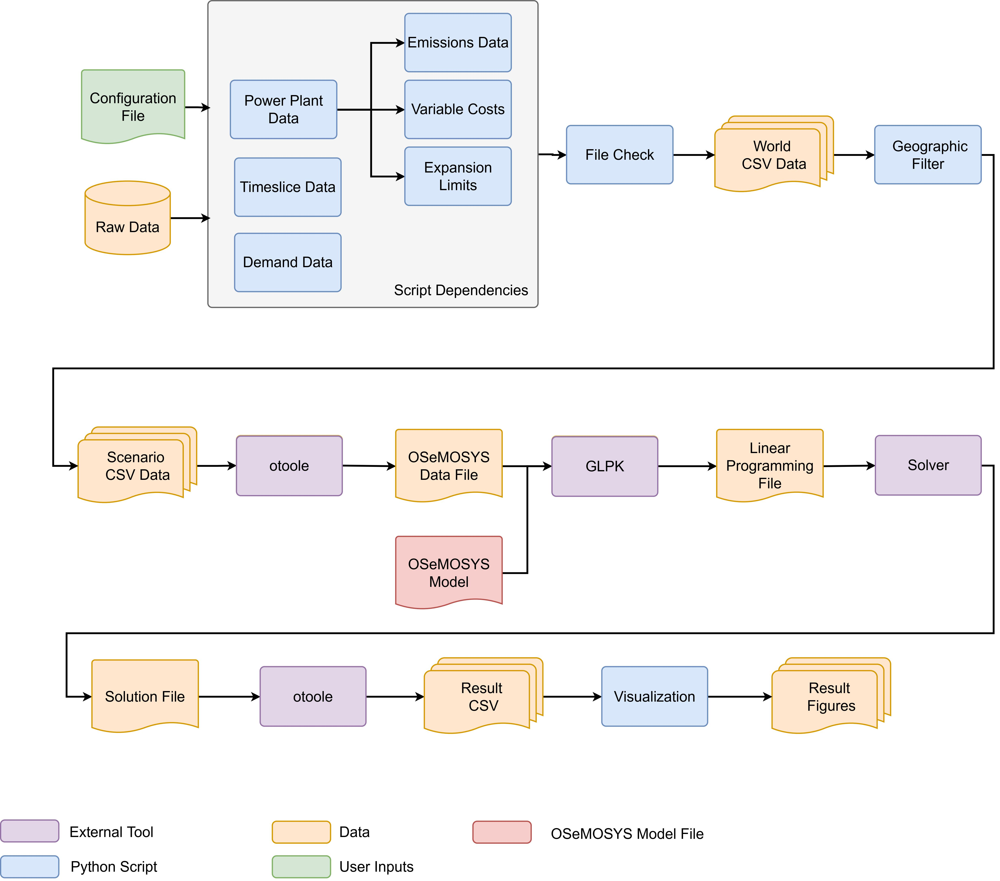

# Contributing

Welcome to **OSeMOSYS Global's** contributor's guide! The following information 
will help make contributing easy for everyone involved.

This document focuses on getting any potential contributor familiarized with 
the development processes, but 
[other kinds of contributions](https://opensource.guide/how-to-contribute) 
are also appreciated. If you are new to using [git](https://git-scm.com) or 
have never collaborated in a project previously, please have a look at 
[contribution-guide.org](https://www.contribution-guide.org/). Other resources 
are also listed in the excellent 
[guide created by FreeCodeCamp](https://github.com/FreeCodeCamp/how-to-contribute-to-open-source). 
Please notice, all users and contributors are expected to be **open, 
considerate, reasonable, and respectful**. When in doubt, 
[Python Software Foundation's Code of Conduct](https://www.python.org/psf/conduct/) 
is a good reference in terms of behavior guidelines.

Thank you for contributing to OSeMOSYS Global! 

## Questions and Discussions

If you have general questions or comments on the project, please submit them
to our 
[community discussion board](https://github.com/OSeMOSYS/osemosys_global/discussions). 
Maintainers and community collaborators will respond in the thread to ensure 
communication stays open and available for future reference. Please review our 
Code of Conduct document for further questions regarding communication standards.

## Issue Reports

If you experience bugs or general issues with OSeMOSYS Global, please have a 
look on the [issue tracker](https://github.com/OSeMOSYS/osemosys_global/issues). 
If you don't see anything useful there, please feel free to 
[file an issue report](https://github.com/OSeMOSYS/osemosys_global/issues/new/choose).

:::{tip}
Don't forget to include the closed issues in your search.
Sometimes a solution was already reported, and the problem is considered 
**solved**.
:::

New issue reports should include information about your programming environment
(e.g., operating system, Python version) and steps to reproduce the problem.
Please try also to simplify the reproduction steps to a very minimal example
that still illustrates the problem you are facing. By removing other factors,
you help us to identify the root cause of the issue. There are four templates 
set up to help with this process: 

Bug Report
: Issues relating to code/workflow errors

Data 
: Issues relating to missing or incorrect data

Documentation
: Issues relating to documentation

Feature request
: Ideas to help us improve the project 

:::{note}
As with any project, OSeMOSYS Global is continually evolving and has bugs. If
you encounter a bug, **please don't ignore it**! 
:::

## Documentation Improvements 

You can help improve OSeMOSYS Global docs by making them more readable and 
coherent, or by adding missing information and correcting mistakes.

OSeMOSYS Global's documentation uses 
[Sphinx](https://www.sphinx-doc.org/en/master/) as its main documentation 
compiler. This means that the docs are kept in the same repository as the 
project code, and that any documentation update is done in the same way was a 
code contribution. We use Markdown language with 
[MyST](https://myst-parser.readthedocs.io/en/latest/syntax/syntax.html) 
extensions

:::{tip}
Please notice that the 
[GitHub web interface](https://docs.github.com/en/repositories/working-with-files/managing-files/editing-files) 
provides a quick way of propose changes in OSeMOSYS Global's files. While this 
mechanism can be tricky for normal code contributions, it works perfectly fine 
for contributing to the docs, and can be quite handy.

If you are interested in trying this method out, please navigate to the `docs/` 
folder, find which file you would like to propose changes and click in the 
little pencil icon at the top, to open 
[GitHub's code editor](https://docs.github.com/en/repositories/working-with-files/managing-files/editing-files). 
Once you finish editing the file, please write a message in the form at the 
bottom of the page describing which changes have you made and what are the 
motivations behind them and submit your proposal.
:::

When working on documentation changes in your local machine, you can
compile them using [tox](https://tox.wiki/en/stable/):

```bash
tox -e docs
```

and use Python's built-in web server for a preview in your web browser
(`http://localhost:8000`)

```bash
python3 -m http.server --directory 'docs/_build/html'
```

## Project Structure

OSeMOSYS Global follows uses [Snakemake](https://snakemake.readthedocs.io/en/stable/)
to manage its configurable workflow. Before contributing, please review the
summary of the workflow and directory structure below.

### Workflow Logic

The high-level overview of the OSeMOSYS Global’s Snakemake workflow is shown 
below. The user starts by inputting parameters into a configuration file 
and running the workflow, which will execute all steps shown automatically. 
To start, Python scripts process the raw data into formatted scenario data. 
The Python package `otoole` is then used to create an OSeMOSYS compatible data 
file, which is combined with the OSeMOSYS model file to create a solver 
independent linear programming file. The model is solved and the results are 
processed and visualized. While this is an automated process, all files are 
exposed to the user for exploration. 



### Directory Structure

The directory structure of OSeMOSYS Global follows the recommended 
[snakemake directory structure](https://snakemake.readthedocs.io/en/stable/snakefiles/deployment.html).
The figure below highlights the structure and where contributors can look for
information.

``` bash
osemosys_global
├── config                        # User configurable setup files
│   ├── config.yaml               
├── docs                          # Files for Documentation 
├── resources                     # Raw Data and OSeMOSYS File 
├── resutls                       # Will appear after running 
│   ├── data                      # World Data
│   ├── figs                      # Global demand projection figures 
│   ├── scenario_name             # Repeted folder for each scenario run
│   │   ├── data/                 # Scenario input CSV data
│   │   ├── figures/              # Scenario result figures
│   │   ├── results/              # Scenario result CSV data
│   │   ├── scenario_name.txt     # Scenario data file
├── workflow                      # All tools for the workflow
│   ├── envs                      # Conda environemnts
│   ├── notebooks                 # Jupyter Notebooks
│   ├── rules                     # snakemake modules
│   ├── scripts                   # Data processing scripts
│   ├── snakefile                 # callable snakefile                   
```

## Code Contributions

The following steps will walk through how to submit code changes. 

:::{seealso}
Before contributing, please see our 
[installation instructions](installation.md#installation) and working 
[examples](getting-started.md#examples)
:::

### 1. Submit an Issue

Before you work on any non-trivial code contribution it's best to first create
a report in the [issue tracker](https://github.com/OSeMOSYS/osemosys_global/issues) 
to start a discussion on the subject. This often provides additional considerations 
and avoids unnecessary work.

### 2. Install the osemosys-global Conda Environment

Before you start coding, we recommend creating an isolated 
[virtual environment](https://realpython.com/python-virtual-environments-a-primer/) 
to avoid any problems with your installed Python packages. This can easily be 
done via [Miniconda](https://docs.conda.io/en/latest/miniconda.html):

:::{seealso}
How to [install](installation.md#5-create-the-conda-environment) OSeMOSYS 
Global's prepared conda environment
:::

1. Install the OSeMOSYS Global conda environment.

    ``` bash
    (base) $ conda env create -f workflow/envs/osemosys-global.yaml    
    ```
    
2. Activate the OSeMOSYS Global conda environment

    ``` bash
    (base) $ conda activate osemosys-global 

    (osemosys-global) $   
    ```

### 3. Clone the repository

1. Create an user account on [GitHub](https://github.com/) if you do not 
already have one.

2. Fork the project [repository](https://github.com/OSeMOSYS/osemosys_global) 
by clicking on the **Fork** button near the top of the page. This creates a 
copy of the code under your account on the repository service. 

3. Clone this copy to your local disk:

    ``` bash 
    (osemosys-global ) ~/repositories$ git clone https://github.com/<github_username>/OSeMOSYS/osemosys_global.git

    (osemosys-global ) ~/repositories$ cd osemosys_global

    (osemosys-global ) ~/osemosys_global$
    ```

<!-- 4. Install OSeMOSYS Global in editable mode to be able to import the package 
under development

    ``` bash
    (osemosys-global) ~/osemosys_global$ pip install -U pip setuptools -e .
    ``` -->

<!---
#. Install [pre-commit](https://pre-commit.com/)

    pip install pre-commit
    pre-commit install

   ``osemosys_global`` comes with a lot of hooks configured to automatically help the
   developer to check the code being written.
-->

### 4. Implement your changes

1. Create a new branch with a name in the form of `issue-###` where `###` is
the auto assigned issue number from GitHub.

    ```bash
    (osemosys-global) ~/osemosys_global$ git checkout -b issue-###
    ```

   and start making changes. **Never work on the main branch!**

2. Start your work on this branch. Don't forget to add 
[docstrings](https://www.sphinx-doc.org/en/master/usage/extensions/napoleon.html) 
to new functions, modules and classes, especially if they are part of public APIs.

3. When you’re done editing:

    ```bash
    (osemosys-global) ~/osemosys_global$ git add <MODIFIED FILES>

    (osemosys-global) ~/osemosys_global$ git commit -m 'descripitve commit message'

    (osemosys-global) ~/osemosys_global$ git push
    ```

   to record your changes in [git](https://git-scm.com).

<!---
   .. todo:: if you are not using pre-commit, please remove the following item:

   Please make sure to see the validation messages from |pre-commit|_ and fix
   any eventual issues.
   This should automatically use flake8_/black_ to check/fix the code style
   in a way that is compatible with the project.

   .. important:: Don't forget to add unit tests and documentation in case your
      contribution adds an additional feature and is not just a bugfix.

      Moreover, writing a `descriptive commit message`_ is highly recommended.
      In case of doubt, you can check the commit history with::

         git log --graph --decorate --pretty=oneline --abbrev-commit --all

      to look for recurring communication patterns.
-->

<!-- 
4. Please check that your changes don't break any unit tests with::

    ```bash
    tox
    ```

   (after having installed [tox](https://tox.wiki/en/stable/) with `pip install tox` or `pipx`).

   You can also use [tox](https://tox.wiki/en/stable/) to run several other pre-configured tasks in the repository. Try `tox -av` to see a list of the available checks. 
-->

### 5. Submit your contribution

1. If everything works fine, push your local branch to 
[GitHub](https://github.com/OSeMOSYS/osemosys_global) with:

    ```bash
    git push -u origin my-feature
    ```

2. Go to the web page of your fork and click 
[Create a Pull Request](https://github.com/OSeMOSYS/osemosys_global/pulls) to 
send your changes for review.

    :::{tip}
    Find more detailed information in 
    [creating a PR](https://docs.github.com/en/pull-requests/collaborating-with-pull-requests/proposing-changes-to-your-work-with-pull-requests/creating-a-pull-request). 
    You might also want to open the PR as a draft first and mark it as ready 
    for review after the feedbacks from the continuous integration (CI) system 
    or any required fixes.
    :::

### 6. Troubleshooting Build

The following tips can be used when facing problems to build or test the
package:

1. Make sure to fetch all the tags from the upstream 
[repository](https://github.com/OSeMOSYS/osemosys_global). The command 
`git describe --abbrev=0 --tags` should return the version you are expecting. 
If you are trying to run CI scripts in a fork repository,make sure to push all 
the tags.
   
   You can also try to remove all the egg files or the complete egg folder, i.e.,
   `.eggs`, as well as the `*.egg-info` folders in the `workflow/scripts` folder 
   or potentially in the root of your project.

2. Sometimes [tox](https://tox.wiki/en/stable/) misses out when new 
dependencies are added, especially to `setup.cfg` and `docs/requirements.txt`. 
If you find any problems with missing dependencies when running a command with 
`tox`, try to recreate the `tox` environment using the `-r` flag. For example, 
instead of:

    ```bash
    tox -e docs
    ```

   Try running::

    ```bash
    tox -r -e docs
    ```

3. Make sure to have a reliable `tox` installation that uses the correct 
Python version (e.g., 3.7+). When in doubt you can run::

    ```bash
    tox --version
    ```
    or

    ```bash
    which tox
    ```

   If you have trouble and are seeing weird errors upon running `tox`, you can
   also try to create a dedicated 
   [virtual environment](https://realpython.com/python-virtual-environments-a-primer/) 
   with a `tox` binary freshly installed. For example::

    ```bash
    virtualenv .venv
    source .venv/bin/activate
    .venv/bin/pip install tox
    .venv/bin/tox -e all
    ```

4. `Pytest can drop you`_ in an interactive session in the case an error occurs.
   In order to do that you need to pass a `--pdb` option (for example by
   running `tox -- -k <NAME OF THE FALLING TEST> --pdb`).
   You can also setup breakpoints manually instead of using the `--pdb` option.

### 7. Style Guide

All submitted code follows [Black](https://github.com/psf/black) formatting 
guidelines. In general, we follow the open-source standards outlined by 
Google in their Python [syleguide](https://google.github.io/styleguide/pyguide.html).

<!---
## Maintainer tasks

### Releases

.. todo:: This section assumes you are using PyPI to publicly release your package.

   If instead you are using a different/private package index, please update
   the instructions accordingly.

If you are part of the group of maintainers and have correct user permissions
on PyPI_, the following steps can be used to release a new version for
``osemosys_global``:

#. Make sure all unit tests are successful.
#. Tag the current commit on the main branch with a release tag, e.g., ``v1.2.3``.
#. Push the new tag to the upstream repository_, e.g., ``git push upstream v1.2.3``
#. Clean up the ``dist`` and ``build`` folders with ``tox -e clean``
   (or ``rm -rf dist build``)
   to avoid confusion with old builds and Sphinx docs.
#. Run ``tox -e build`` and check that the files in ``dist`` have
   the correct version (no ``.dirty`` or git_ hash) according to the git_ tag.
   Also check the sizes of the distributions, if they are too big (e.g., >
   500KB), unwanted clutter may have been accidentally included.
#. Run ``tox -e publish -- --repository pypi`` and check that everything was
   uploaded to PyPI_ correctly.
-->