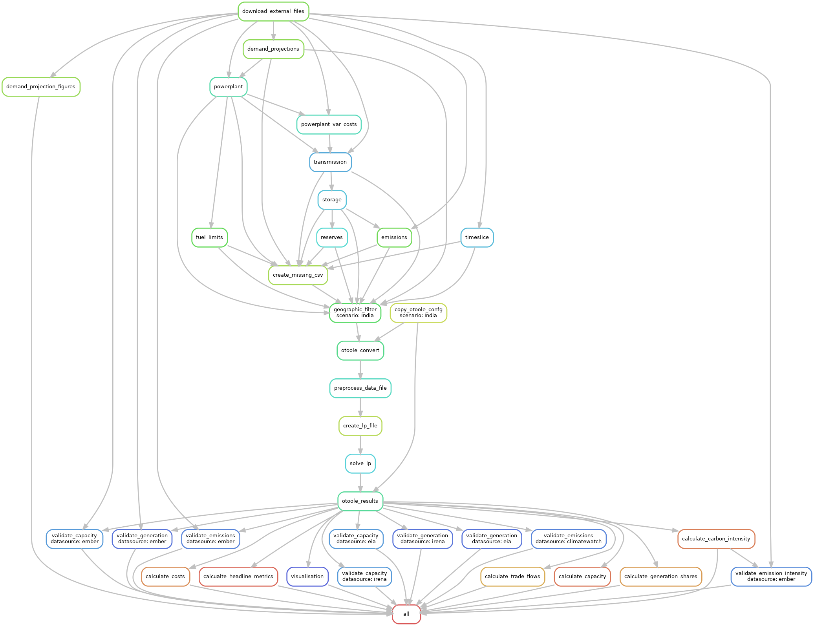

# Contributing

Welcome to **OSeMOSYS Global's** contributor's guide! The following information will help make contributing easy for everyone involved.

This document focuses on getting any potential contributor familiarized with the development processes, but [other kinds of contributions](https://opensource.guide/how-to-contribute) are also appreciated. If you are new to using [git](https://git-scm.com) or have never collaborated in a project previously, please have a look at [contribution-guide.org](https://www.contribution-guide.org/). Other resources are also listed in the excellent [guide created by FreeCodeCamp](https://github.com/FreeCodeCamp/how-to-contribute-to-open-source). Please notice, all users and contributors are expected to be **open, 
considerate, reasonable, and respectful**. When in doubt, [Python Software Foundation's Code of Conduct](https://www.python.org/psf/conduct/) is a good reference in terms of behavior guidelines.

Thank you for contributing to OSeMOSYS Global! 

## Questions and Discussions

If you have general questions or comments on the project, please submit them to our [community discussion board](https://github.com/OSeMOSYS/osemosys_global/discussions). Maintainers and community collaborators will respond in the thread to ensure communication stays open and available for future reference.

## Issue Reports

If you experience bugs or general issues with OSeMOSYS Global, please have a look on the [issue tracker](https://github.com/OSeMOSYS/osemosys_global/issues). If you don't see anything useful there, please feel free to 
[file an issue report](https://github.com/OSeMOSYS/osemosys_global/issues/new/choose).

:::{tip}
Don't forget to include the closed issues in your search. Sometimes a solution was already reported, and the problem has been  solved.
:::

New issue reports should include information about your programming environment (e.g., operating system, Python version) and steps to reproduce the problem. Please try also to simplify the reproduction steps to a very minimal example that still illustrates the problem you are facing. By removing other factors, you help us to identify the root cause of the issue. There are four templates set up to help with this process: 

Bug Report
: Issues relating to code/workflow errors

Data 
: Issues relating to missing or incorrect data

Documentation
: Issues relating to documentation

Feature request
: Ideas to help us improve the project 

:::{note}
As with any project, OSeMOSYS Global is continually evolving and has bugs. If you encounter a bug, **please don't ignore it**! 
:::

## Documentation Improvements 

You can help improve OSeMOSYS Global docs by making them more readable and coherent, or by adding missing information and correcting mistakes.

OSeMOSYS Global's documentation uses [Sphinx](https://www.sphinx-doc.org/en/master/) as its main documentation compiler. This means that the docs are kept in the same repository as the project code, and that any documentation update is done in the same way was a  code contribution. We use Markdown language with [MyST](https://myst-parser.readthedocs.io/en/latest/syntax/syntax.html) extensions.

:::{tip}
Please notice that the [GitHub web interface](https://docs.github.com/en/repositories/working-with-files/managing-files/editing-files) provides a quick way of propose changes in OSeMOSYS Global's files. While this mechanism can be tricky for normal code contributions, it works perfectly fine for contributing to the docs, and can be quite handy.

If you are interested in trying this method out, please navigate to the `docs/` folder, find which file you would like to propose changes and click in the little pencil icon at the top, to open [GitHub's code editor](https://docs.github.com/en/repositories/working-with-files/managing-files/editing-files). Once you finish editing the file, please write a message in the form at the bottom of the page describing which changes have you made and what are the motivations behind them and submit your proposal.
:::

When working on documentation changes in your local machine, you cancompile them using [`tox`](https://tox.wiki/en/stable/). First install `tox` into your environmenmt:

```bash
(osemosys-global) $ pip install tox
```

Then build the documentation using `tox`

```bash
(osemosys-global) $ tox -e docs
```

Fianlly, use Python's built-in web server for a preview in your web browser at `http://localhost:8000`

```bash
(osemosys-global) $ python3 -m http.server --directory 'docs/_build/html'
```

:::{tip}
If you run into errors with building through `tox`, ensure you install `cartopy`'s dependencies as described [here](https://scitools.org.uk/cartopy/docs/latest/installing.html#required-dependencies)
:::

## Project Structure

OSeMOSYS Global follows uses [Snakemake](https://snakemake.readthedocs.io/en/stable/) to manage the workflow. Before contributing, please review the summary of the workflow and directory structure below.

### Workflow Logic

The OSeMOSYS Global workflow is shown below. Each rule (or job) is self documenting and can be found in the `workflow/rules` folder. The general workflow is:
1. The user inputs parameters into the configuration file and launches the workflow.
2. A series of Python scripts process the raw data into formatted scenario data based on the provided configuration options. The data structre follows [`otoole`](https://otoole.readthedocs.io/en/latest/) format.
3. `otoole` is used to create an OSeMOSYS compatible datafile
4. The datafile and OSeMOSYS model file are processed by [`GLPK`](https://www.gnu.org/software/glpk/) to create a solver independent linear programming file. 
5. The model is solved by the user selected solver.
6. Solver results are processed by `otoole`
7. Visualization and validation charts are provided.



### Directory Tree

The directory structure of OSeMOSYS Global follows the recommended [snakemake directory structure](https://snakemake.readthedocs.io/en/stable/snakefiles/deployment.html). The figure below highlights the structure and where contributors can look for
information.

``` bash
osemosys_global
├── config/                        
│   ├── config.yaml                # User configurable setup files
├── docs/                          # Files for documentation 
├── resources/                     # Dependencies for the workflow
│   ├── data/                      # Data ingested by the workflow
│       ├── custom/                # User configurable data
│       ├── default/               # Default data (DO NOT TOUCH)
│       ├── validation/            # Data used for validation (DO NOT TOUCH)
│   ├── osemosys.txt               # OSeMOSYS Model File
├── resutls/                       # Will appear after running 
│   ├── data/                      # Temporary data collection
│   ├── figs/                      # Global demand projection figures 
│   ├── scenario_name/             # Results for your scenario
│       ├── data/                  # Input CSV data
│       ├── figures/               # Result figures
│       ├── results/               # OSeMOSYS varibale result CSV data
│       ├── result_summaries/      # Processed summarized results 
│       ├── validation/            # Validation results 
│       ├── scenario_name.txt      # Scenario data file
├── workflow/                      # All tools for the workflow
│   ├── envs/                      # Conda environemnts
│   ├── rules/                     # snakemake rules
│   ├── scripts/                   # Data processing scripts called by rules
│   ├── snakefile                  # snakefile                   
```

## Code Contributions

The following steps will walk through how to submit code changes. 

:::{seealso}
Before contributing, please see our [installation instructions](installation.md#installation)
:::

### 1. Submit an Issue

Before you work on any non-trivial code contribution it's best to first create an [issue ticket](https://github.com/OSeMOSYS/osemosys_global/issues) to start a discussion on the subject. This often provides additional considerations and avoids unnecessary work.

### 2. Install the `osemosys-global` Conda Environment

Before you start coding, ensure you have followd the environment install instructions [here](installation.md#2-install-mamba). Active the `osemosys-global` environment with:

```bash
(base) $ conda activate osemosys-global 
(osemosys-global) $   
```

### 3. Fork and clone the repository

Fork the project [repository](https://github.com/OSeMOSYS/osemosys_global) by clicking on the **Fork** button near the top of the page. This creates a copy of the code under your account on the repository service. 

Clone this copy to your local disk:

``` bash 
(osemosys-global ) ~/repositories$ git clone https://github.com/<github_username>/OSeMOSYS/osemosys_global.git

(osemosys-global ) ~/repositories$ cd osemosys_global

(osemosys-global ) ~/osemosys_global$
```

### 4. Implement your changes

Create a new branch with a name in the form of `issue-###` where `###` is the auto assigned issue number from GitHub.

```bash
(osemosys-global) ~/osemosys_global$ git checkout -b issue-###
```

and start making changes. **Never work on the main branch!** Don't forget to add [docstrings](https://www.sphinx-doc.org/en/master/usage/extensions/napoleon.html) to new functions, modules and classes. When you are done editing, push your changes.

```bash
(osemosys-global) ~/osemosys_global$ git add <MODIFIED FILES>

(osemosys-global) ~/osemosys_global$ git commit -m 'descripitve commit message'

(osemosys-global) ~/osemosys_global$ git push -u origin issue-###
```

### 5. Submit your contribution

Go to the web page of your fork and click [Create a Pull Request](https://github.com/OSeMOSYS/osemosys_global/pulls) to 
send your changes for review. Add yourself to the list of contributors in `AUTHORS.md`.

:::{tip}
Find more detailed information in [creating a PR](https://docs.github.com/en/pull-requests/collaborating-with-pull-requests/proposing-changes-to-your-work-with-pull-requests/creating-a-pull-request). You might also want to open the PR as a draft first and mark it as ready for review after the feedbacks from the continuous integration (CI) system or any required fixes.
:::