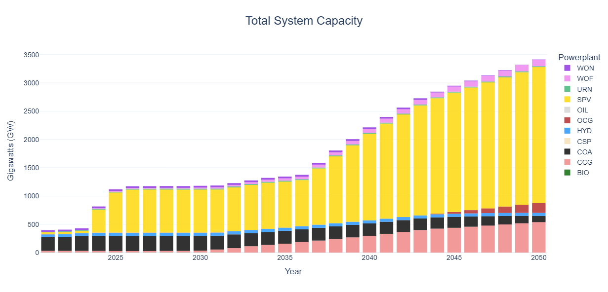
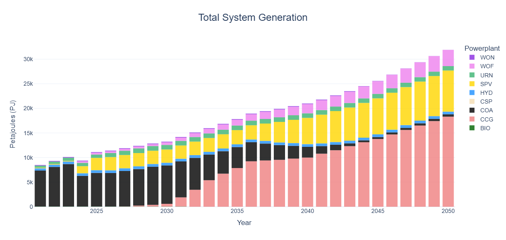
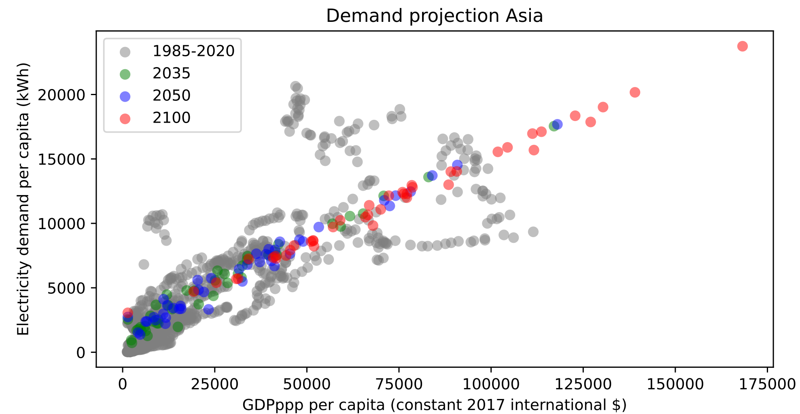
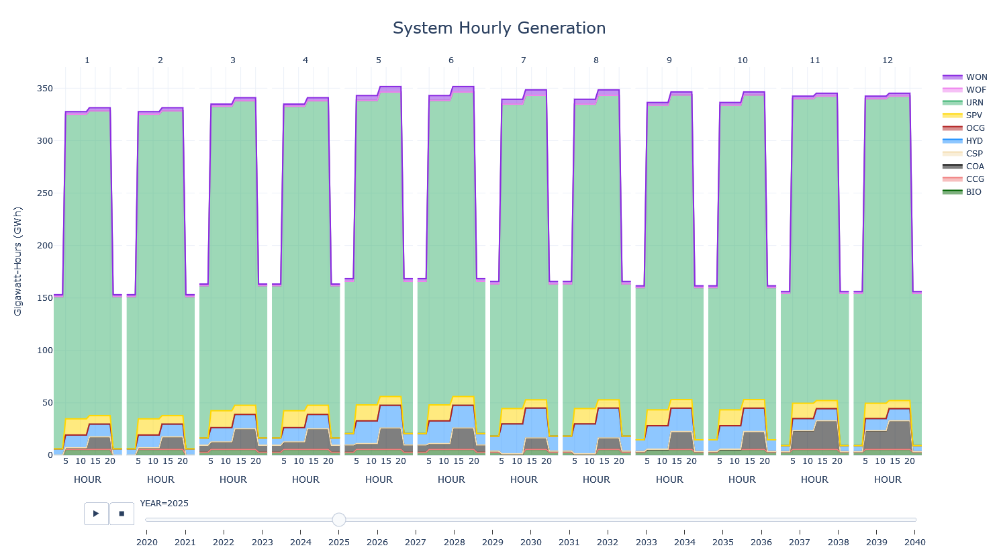
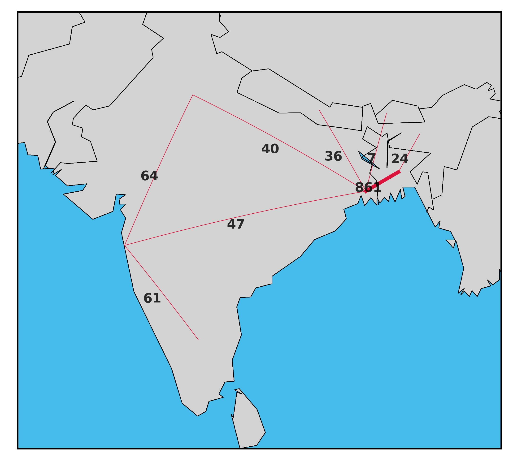

# Examples

Below are some simple examples you can follow to understand how OSeMOSYS Global
works. 

:::{caution}
Before running any examples, ensure you first follow our 
[installation instructions](installation.md#installation) and perform the 
following two steps.

1. Navigate to the root OSeMOSYS Global directory in the command line 

    ```bash
    (base) $ cd ~/osemosys_global 

    (base) ~/osemosys_global$ 
    ```

2. Activate the `osemosys-global` conda environment

    ```bash
    (base) ~/osemosys_global$ conda activate osemosys-global

    (osemosys-global) ~/osemosys_global$
    ```
:::

:::{warning}
If you installed CPLEX or Gurobi instead of CBC, you must first change this in 
the configuration file at `config/config.yaml`
:::

## Example 1

**Goal**: Run the workflow with default settings. This will produce a model 
of India from 2015 to 2050 with 8 time slices per year, and solve it using CBC.

1. Run the command `snakemake -j6`. The time to build and solve the model will
vary depending on your computer, but in general, this example will finish 
within minutes .

    ```bash
    (osemosys-global) ~/osemosys_global$ snakemake -j6
    ```

    :::{tip}
    The `-j6` command will instruct Snakemake to use six cores.
    If your want to restrict this, change the number after the `-j` to 
    specify the number of cores. For example, the command `snakemake -j2` will
    run the workflow using 2 cores. See 
    [snakemake's documentation](https://snakemake.readthedocs.io/en/stable/executing/cli.html#useful-command-line-arguments) 
    for more information.   
    :::

2. Navigate to the newly created `results/` folder. All available automatically 
generated results are summarized below. 

    ``` bash
    osemosys_global             
    ├── resutls            # Will appear after running the workflow
    │   ├── data           # Global CSV OSeMOSYS data         
    │   ├── figs           
    │   │   ├── ...        # Global demand projections
    │   ├── india          # Name of scenario
    │   │   ├── data/      # Scenario input CSV data
    │   │   ├── figures            
    │   │   │   ├── GenerationAnnual.html
    │   │   │   ├── GenerationHourly.html
    │   │   │   ├── TotalCapacityAnnual.html
    │   │   │   ├── TransmissionCapacity2050.jpg
    │   │   │   ├── TransmissionFlow2050.jpg
    │   │   ├── result_summaries    
    │   │   │   ├── Capacities.csv
    │   │   │   ├── Generation_By_Node.csv
    │   │   │   ├── Generation.csv
    │   │   │   ├── Metrics.csv
    │   │   │   ├── TradeFlows.csv
    │   │   ├── results/   # Scenario result CSV data
    │   │   ├── india.txt  # Scenario OSeMOSYS data file                       
    └── ...
    ```

    | File    | Description |
    |---------|-------------|
    | `GenerationAnnual.html` | Plot of system level annual generation by technology |
    | `GenerationHourly.html` | Plot of system level technology generation by timeslice |
    | `TotalCapacityAnnual.html` | Plot of system level annual capacity by technology |
    | `Capacities.csv` | Table of nodal level annual capacity by technology |
    | `Generation_By_Node.csv` | Table of nodal level technology generation by timeslice |
    | `Generation.csv` | Table of system level technology generation by timeslice |
    | `Metrics.csv` | Table of system level cost and emission statistics |
    | `TradeFlows.csv` | Table of nodal level electricity trade by timeslice |
    | `TransmissionCapacityXXXX.jpg` | Transmission capacity plot for last year of model |
    | `TransmissionFlowXXXX.jpg` | Transmission flow plot for last year of model |

3. View system level capacity and generation results. 

    :::{caution}
    These results are used to showcase the capabilities of OSeMOSYS Global. The
    actual energy supply mix results may need further analysis, such as removing 
    technology bias though implementing resource limits on nuclear.
    :::

    
    

    :::{tip}
    These plots are interactive! Howver over the bars to view values, or 
    double click on a power plant in the legend to single it out. 
    :::

4. View demand projections results for Asia in the file 
`results/figs/Demand projection Asia.jpg`. Grey dots represent historical 
country level values for countries in Asia and the coloured dots show projected 
values.

    

## Example 2

**Goal**: Modify the geographic scope, temporal settings, and emission penalty 
of the model. 

The goal of this scenario will be to change the geographic scope to add 
Bangladesh, Bhutan, and Nepal to the model. Moreover, we will change the model
horizon to be from 2020-2040 and increase the number of time slices per year 
from 8 to 18. Finally, we will ensure cross border trade is allowed, set the 
emission penalty to $50/T, and create country level result plots.

1. Navigate to and open the file `config/config.yaml`

2. Change the scenario name to BBIN (**B**angladesh, **B**hutan, **I**ndia, 
and **N**epal)

    ```yaml
    scenario: 'BBIN'
    ```

3. Change the geographic scope to include the mentioned countries.

    ```yaml
    geographic_scope:
      - 'IND'
      - 'BGD'
      - 'BTN'
      - 'NPL'
    ```

4. Change the model horizon to be from 2020 to 2040. Both numbers are inclusive.

    ```yaml
    startYear: 2020
    endYear: 2040
    ```

5. Change the number of day parts to represent three even 8 hour segments per 
day. The start number is inclusive, while the end number is exclusive.

    ```yaml
    dayparts:
      D1: [0, 8]
      D2: [8, 16]
      D3: [16, 24]
    ```

6. Change the number of seasons to represent 6 equally spaced days. Both numbers
are inclusive.  

    ```yaml
    seasons:
      S1: [1, 2]
      S2: [3, 4]
      S3: [5, 6]
      S4: [7, 8]
      S5: [9, 10]
      S6: [11, 12]
    ```

    :::{tip}
    A timeslice strucutre of 6 seasons and 3 dayparts will result in a model 
    with 18 timeslices per year; 6 representative days each with 3 timeslices. 

    See the [OSeMOSYS documentation](https://osemosys.readthedocs.io/en/latest/index.html)
    has more information on the OSeMOSYS timeslice parameters. 
    :::

6. Ensure the `crossborderTrade` parameter is set to `True`

    ```yaml
    crossborderTrade: True
    ```

7. Change the emission penalty to `50` $/T

    ```yaml
    emission_penalty:
      - ["CO2", "IND", 2020, 2040, 50]
      - ["CO2", "BGD", 2020, 2040, 50]
      - ["CO2", "BTN", 2020, 2040, 50]
      - ["CO2", "NPL", 2020, 2040, 50]
    ```

8. Run the command `snakemake -j6`

    ```bash
    (osemosys-global) ~/osemosys_global$ snakemake -j6
    ```

    :::{tip}
    If you run into any issues with the workflow, run the command 
    `snakemake clean -c`. This will delete any auto generated files and 
    bring you back to a clean start. 
    :::

9. Navigate to the `results/` folder to view results from this model run.

    Notice how under `figures/`, there is now a folder for each country. By 
    setting the `crossborderTrade` parameter to be true, we tell the 
    workflow to create out both system level and country level plots. 

    ``` bash
    osemosys_global             
    ├── resutls            
    │   ├── data           # Global CSV OSeMOSYS data         
    │   ├── figs           
    │   │   ├── ...        # Global demand projections
    │   ├── india          
    │   ├── BBIN          # Name of scenario
    │   │   ├── data/     # Scenario input CSV data
    │   │   ├── figures   
    │   │   │   ├── BTN
    │   │   │   │   ├── GenerationAnnual.html
    │   │   │   │   ├── TotalCapacityAnnual.html         
    │   │   │   ├── BGD
    │   │   │   │   ├── GenerationAnnual.html
    │   │   │   │   ├── TotalCapacityAnnual.html         
    │   │   │   ├── IND
    │   │   │   │   ├── GenerationAnnual.html
    │   │   │   │   ├── TotalCapacityAnnual.html         
    │   │   │   ├── NPL
    │   │   │   │   ├── GenerationAnnual.html
    │   │   │   │   ├── TotalCapacityAnnual.html         
    │   │   │   ├── GenerationAnnual.html
    │   │   │   ├── GenerationHourly.html
    │   │   │   ├── TotalCapacityAnnual.html
    │   │   │   ├── TransmissionCapacity2040.jpg
    │   │   │   ├── TransmissionFlow2040.jpg
    │   │   ├── result_summaries   # Auto generated result tables
    │   │   ├── results/   # Scenario result CSV data
    │   │   ├── BBIN.txt  # Scenario OSeMOSYS data file                       
    └── ...
    ```

    :::{note}
    If you don't change clean the model results, the previous scenario 
    results are saved as long as you change the scenario name. 
    :::

10. View system level 2040 hourly generation results by viewing the file
`results/BBIN/figures/GenerationHourly.html`

    :::{caution}
    These results are used to showcase the capabilities of OSeMOSYS Global. The
    actual energy supply mix results may need further analysis, such as removing 
    technology bias though implementing resource limits on nuclear.
    :::

    

3. View system level metrics for this model run by looking at the file 
`results/BBIN/result_summaries/Metrics.csv`

    | Metric              | Unit                      | Value |
    |---------------------|---------------------------|-------|
    | Emissions	          | Million tonnes of CO2-eq. | 1221  |
    | RE Share            | %                         | 10    |
    | Total System Cost	  | Billion $                 | 1544  |
    | Cost of electricity | $/MWh                     | 20    |
    | Fossil fuel share   | %                         | 4     |


## Example 3

**Goal**: Rerun the BBIN example with new interconnectors.

The goal of this scenario will be to rerun the BBIN scenario 
([example 2](#example-2)), except we will tell the model to install three new
electricity interconnectors. In 2025 we will install a 3GW interconnector 
between India and Nepal. Then in 2030 we will install a 1GW and 750MW
interconnector between India and Bhutan and India and Bangladesh respectively. 

1. Change the scenario name

    ```yaml
    scenario: 'BBIN_Interconnector'
    ```

2. Configure the new interconnectors

    ```yaml
    user_defined_capacity:
      TRNINDNONPLXX: [3, 2025]
      TRNINDNEBTNXX: [1, 2030]
      TRNINDEABGDXX: [0.75, 2030]
    ```

    :::{note}
    The last two letters in the region (ie. `NO`, `NE`, and `EA` for India, or
    `XX` for Nepal, Bhutan and Bangladesh) represent the node in each region. 
    See our [model structure](./model-structure.md#spatial-codes) 
    document for more information on this. 
    :::

3. View the trade capacity plot in 2040 by looking at the file 
`results/BBIN_interconnector/figures/TransmissionCapacity2040.jpg`

    

4. View the trade flow plot in 2040 by looking at the file 
`results/BBIN_interconnector/figures/TransmissionFlow2040.jpg`

    


## Example 4

**Goal**: Run a World Example

The goal of this scenario is to run a World scenario from 2015 to 2050 with
8 time slices, solve it using CPLEX, and graphing results at a system level only

1. Change the scenario name

    ```yaml
    scenario: 'WORLD'
    ```

2. Delete everything under the geographic scope

    ```yaml
    geographic_scope:
    ```

    :::{caution}
    Do **NOT** delete the `geographic_scope:` keyword
    :::

3. Change the model horizon to be from 2015 to 2050. Both numbers are inclusive.

    ```yaml
    startYear: 2015
    endYear: 2050
    ```

4. Reset the temporal parameters back to defaults.

    ```yaml
    dayparts:
      D1: [0, 12]
      D2: [12, 24]

    seasons:
      S1: [12, 1, 2]
      S2: [3, 4, 5]
      S3: [6, 7, 8]
      S4: [9, 10, 11]
    ```

5. Remove the time shift to set to UTC time. 

    ```yaml
    timeshift: 0
    ```

6. Set the results to only graph at a system level

    ```yaml
    results_by_country: False
    ```

7. Set the solver to `CPLEX`

    ```yaml
    solver: 'cplex'
    ```

8. Run the command `snakemake -j6` 

    :::{warning}
    This scenario will take multiple hours to run using a commercial solver 
    (Gurobi or CPLEX) on a high performance computer.
    :::

    ```bash
    (osemosys-global) ~/osemosys_global$ snakemake -j6
    ```

8. View system level results in the `results/WORLD/figures` folder


<!-- ## Custom Nodes 

A user may wish to introduce custom nodes to improve the spatial resolution of a particular region or country. In this example, we show how to break the single node country of Indonesia into seven seperate nodes.  

### 1. Remove the Existing Node

In the configuration file, remove the existing Indonesia node (`INDXX`), through the `nodes_to_remove` parameter

```yaml
nodes_to_remove:
  - 'IDNXX'
```

### 2. Add New Nodes

In the configuration file, add the names of the new nodes you wish to add. In this case we will add the nodes `IDNSM`, `IDNJW`, `IDNNU`, `IDNKA`, `IDNSL`, `IDNML`, `IDNPP`. 

:::{warning}
The custom nodes being added must start with the 3-letter code of the country that they are in (`IDN` in this case). Only the 2-letter regional code can change. 
:::

```yaml
nodes_to_add:
  - 'IDNSM'
  - 'IDNJW'
  - 'IDNNU'
  - 'IDNKA'
  - 'IDNSL'
  - 'IDNML'
  - 'IDNPP'
```

### 3. Add Residual Capacity 

In the folder `resources/data/custom/`, add any residual capacity to the `residual_capacity.csv`. The data must be formatted as show. The fuel type must be one of the existing fuels in the model (see [here](./model-structure.md#acronyms)) and the capacity is given in `GW`.

| FUEL_TYPE | CUSTOM_NODE | START_YEAR | END_YEAR | CAPACITY |
|-----------|-------------|------------|----------|----------|
| COA       | IDNJW       | 2010       | 2040     | 5000     |

### 4. Add Specified Annual Demand

In the folder `resources/data/custom_nodes`, add the annual demand for each node to the `specified_annual_demand.csv`. The data must be formatted as shown, with the demand given in PJ. 

| CUSTOM_NODE | YEAR | VALUE  |
|-------------|------|--------|
| IDNSM       | 2020 | 319.92 |
| IDNSM       | 2021 | 333.22 |
| IDNSM       | 2022 | 346.53 |

### 5. Add Specified Demand Profile 

In the folder `resources/data/custom/`, add the demand profile for each node to the `specified_demand_profile.csv`. The data must be formatted as shown.

| Month | Day | Hour | IDNSM | IDNJW | IDNKA | IDNNU | IDNSL | IDNML | IDNPP |
|-------|-----|------|-------|-------|-------|-------|-------|-------|-------|
| 1     | 1   | 0    | 0.04  | 0.04  | 0.04  | 0.04  | 0.04  | 0.04  | 0.04  |
| 1     | 1   | 1    | 0.04  | 0.04  | 0.04  | 0.04  | 0.04  | 0.04  | 0.04  |
| 1     | 1   | 2    | 0.04  | 0.04  | 0.04  | 0.04  | 0.04  | 0.04  | 0.04  |
| 1     | 1   | 3    | 0.04  | 0.04  | 0.04  | 0.04  | 0.04  | 0.04  | 0.04  |
| 1     | 1   | 4    | 0.04  | 0.04  | 0.04  | 0.04  | 0.04  | 0.04  | 0.04  |

:::{note}
Demand profile data must be given for all hours in a single year. The data will then be aggregated according to the timeslice definition and replicated for each year. 
:::

### 6. Run the model 

Check that the country with custom nodes is listed under the geographic scope in the configuration file 

```yaml
geographic_scope:
    - 'IDN'
```

Then run the workflow as normal from the root directory

```bash
snakemake -j6
``` -->