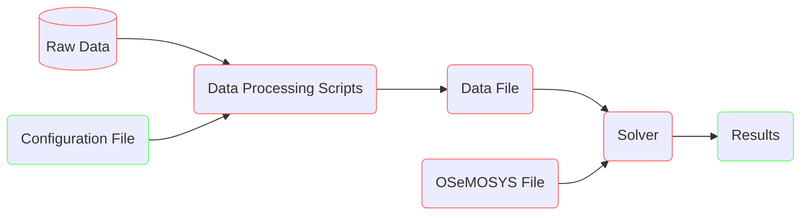

# Examples

## Getting Started

### Flowchart

A high level overview of OSeMOSYS Global is shown below. The green boxes
highlight where the user interfaces with the model. The red boxes highlight
automated actions that run behind the scenes.



### Directory Overview

The main components of the directory that the user will interface with are
highlighted below. It follows the recommended [snakemake directory structure](https://snakemake.readthedocs.io/en/stable/snakefiles/deployment.html).

``` bash
osemosys_global
├── config                        # User configurable setup files
│   ├── config.yaml               
├── resources                      
├── resutls                       # Will appear after running 
│   ├── data                      
│   ├── figs                      # Global demand projection figures 
│   ├── scenario_name             # Repeted folder for each scenario run
│   │   ├── data/                 # Scenario input CSV data
│   │   ├── figures/              # Scenario result figures
│   │   ├── results/              # Scenario result CSV data
│   │   ├── scenario_name.txt     # Scenario data file
├── workflow                         
└── ...
```

## Configuration File

Numerous parameters have been exposed to the user to control the model. These
parameters are stored in the `osemosys_global/config/config.yaml`
[file](https://github.com/OSeMOSYS/osemosys_global/tree/master/config).

### Simple Examples

(example-1)=
#### Run the Workflow with Default Settings

1. Run the command `snakemake -c`

    ```bash
    (osemosys-global) ~/osemosys_global$ snakemake -c
    ```

2. View system level results in the `results/India/figures` folder

(example-2)
#### Modify Geographic Scope and Emission Penalty

The goal of this scenario will be to change the geographic scope to include Bangladesh, Bhutan, India, and Nepal (BBIN). Moreover, trade will be allowed and an emission penalty of $25/Tonne is added. 

1. Change the scenario name in `config/config.yaml`

    ```bash
    scenario: 'BBIN'
    ```

2. Change the geographic scope in `config/config.yaml`

    ```bash
    geographic_scope:
    - 'IND'
    - 'BGD'
    - 'BTN'
    - 'NPL'
    ```

3. Update the `crossborderTrade` parameter in `config/config.yaml`

    ```bash
    crossborderTrade: True
    ```

4. Change the emission penalty in `config/config.yaml`

    ```bash
    emission_penalty: 25 
    ```

5. Run the command `snakemake -c`

    ```bash
    (osemosys-global) ~/osemosys_global$ snakemake -c
    ```

6. View system level and country results in the `results/BBIN/figures` folder

(example-3)=
#### Run a World Example

The goal of this scenario is to run a World scenario from 2020 to 2040 graphing results at a system level only

1. Change the scenario name in `config/config.yaml`

    ```bash
    scenario: 'WORLD'
    ```

2. Delete everything under the geographic scope in `config/config.yaml`

    ```bash
    geographic_scope:
    ```

3. Change the startYear and endYear parameters in `config/config.yaml`

    ```bash
    startYear: 2020
    endYear: 2040
    ```

4. Set the results to only graph at a system level in `config/config.yaml`

    ```bash
    results_by_country: False
    ```

:::{warning}
This scenario will take multiple hours using a commercail solver (Gurobi or CPLEX) on a 
high performance computer
:::

5. Run the command `snakemake -c` 

    ```bash
    (osemosys-global) ~/osemosys_global$ snakemake -c
    ```

6. View system level results in the `results/WORLD/figures` folder

## Support + Feedback

We encourage community memebers to ask questions and report any issues they
encounter.

- For asking general usage questions, please use the [commuity fourm](https://github.com/OSeMOSYS/osemosys_global/discussions/categories/q-a).
- For reporting code and data issues, please use the appropiate [issue template](https://github.com/OSeMOSYS/osemosys_global/issues/new/choose)
