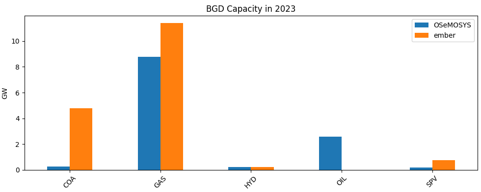
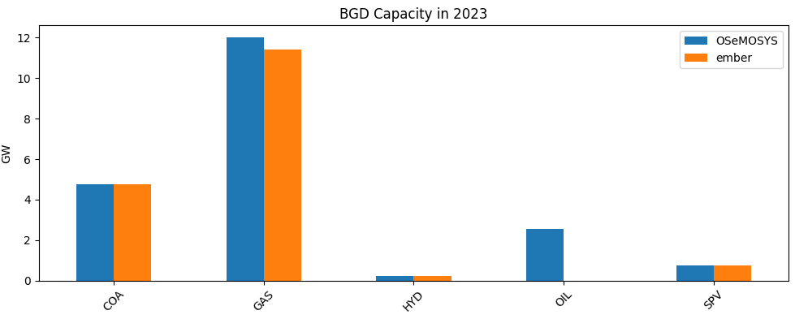
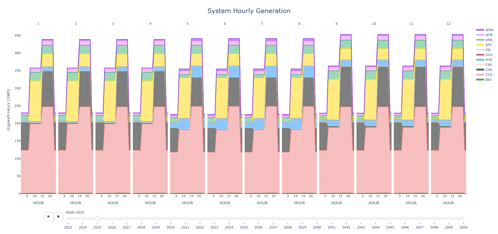
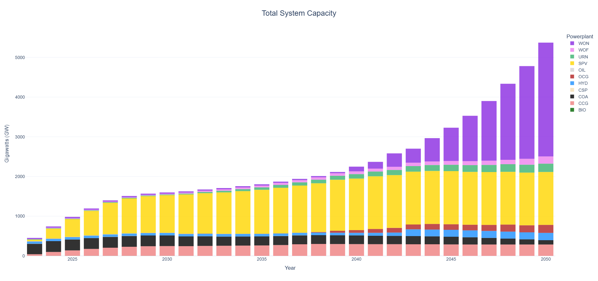
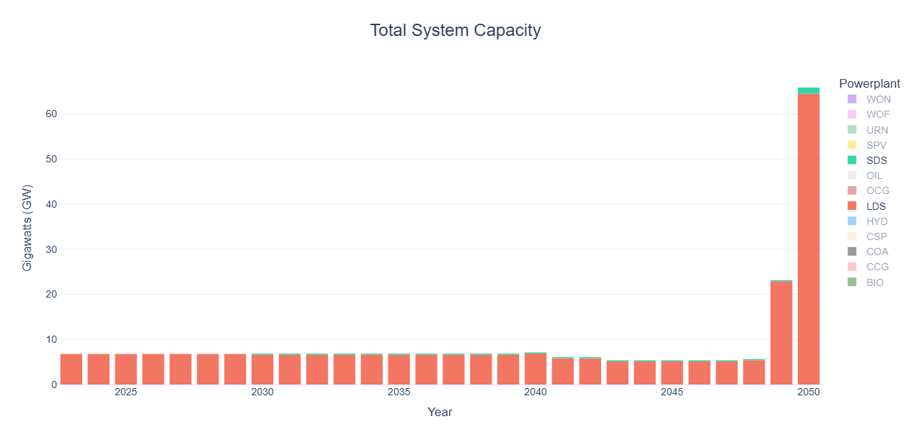
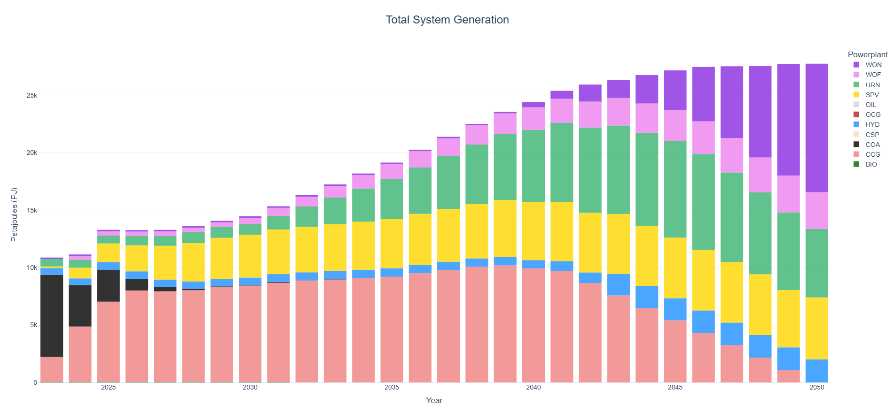
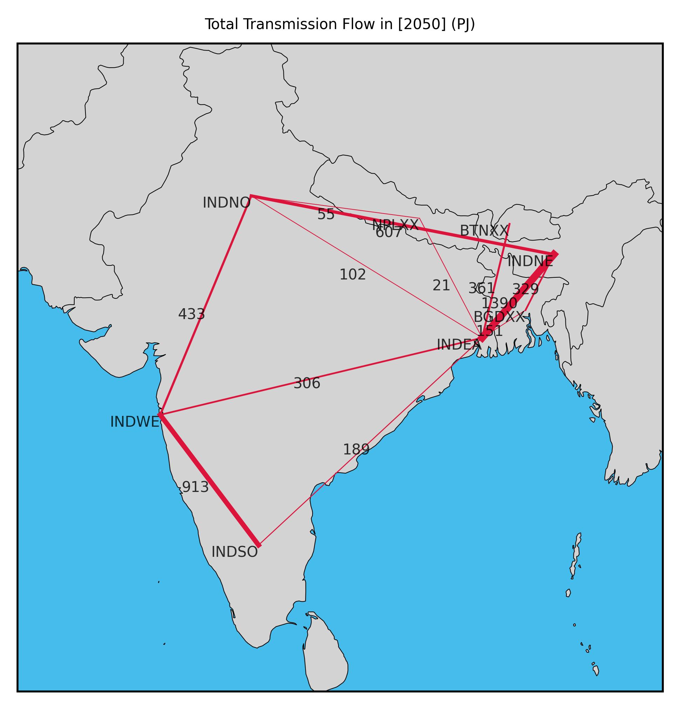

# Examples

Below are some simple examples you can follow to understand how OSeMOSYS Global
works. 

:::{caution}
Before running any examples, ensure you first follow our [installation instructions](installation.md#installation) 
and activate the mamba environment.

    ```bash
    (base) ~/osemosys_global$ mamba activate osemosys-global
    (osemosys-global) ~/osemosys_global$
    ```
:::

:::{warning}
If you installed CPLEX or Gurobi instead of CBC, you must first change this in 
the configuration file at `config/config.yaml` as below

```yaml
solver: "gurobi"
```
:::

## Example 1

**Goal**: Run the workflow with default settings. This will produce a model 
of India from 2021 to 2050 and solve it using CBC.

1. Run the command `snakemake -j6`. The time to build and solve the model will
vary depending on your computer, but in general, this example will finish 
within minutes.

    ```bash
    (osemosys-global) ~/osemosys_global$ snakemake -j6
    ```

    :::{tip}
    The `-j6` command will instruct Snakemake to use six cores.
    If your want to restrict this, change the number after the `-j` to 
    specify the number of cores. For example, the command `snakemake -j2` will
    run the workflow using 2 cores. See 
    [snakemake's documentation](https://snakemake.readthedocs.io/en/stable/executing/cli.html#useful-command-line-arguments) 
    for more information.   
    :::

2. Navigate to the newly created `results/` folder. All available automatically 
generated results are summarized below. 

    ``` bash
    osemosys_global         
    └── results        # Will appear after running the workflow
    ├── data       # Global CSV OSeMOSYS data     
    ├── figs       
    │   ├── ...    # Global demand projections
    └── India      # Name of scenario
        ├── data      # Scenario input CSV data
        ├── figures      # Result figures       
        │   ├── GenerationAnnual.html
        │   ├── GenerationHourly.html
        │   ├── TotalCapacityAnnual.html
        │   ├── TransmissionCapacity2050.jpg
        │   └── TransmissionFlow2050.jpg
        ├── result_summaries   # Auto generated result tables
        │   ├── AnnualEmissionIntensity.csv
        │   ├── AnnualEmissionIntensityGlobal.csv
        │   ├── AnnualExportTradeFlowsCountry.csv
        │   ├── AnnualExportTradeFlowsNode.csv
        │   ├── AnnualImportTradeFlowsCountry.csv
        │   ├── AnnualImportTradeFlowsNode.csv
        │   ├── AnnualNetTradeFlowsCountry.csv
        │   ├── AnnualNetTradeFlowsNode.csv
        │   ├── AnnualTotalTradeFlowsCountry.csv
        │   ├── AnnualTotalTradeFlowsNode.csv
        │   ├── GenerationSharesCountry.csv
        │   ├── GenerationSharesGlobal.csv
        │   ├── GenerationSharesNode.csv
        │   ├── Metrics.csv
        │   ├── PowerCapacityCountry.csv
        │   ├── PowerCapacityNode.csv
        │   ├── PowerCostCountry.csv
        │   ├── PowerCostGlobal.csv
        │   ├── PowerCostNode.csv
        │   ├── TotalCostCountry.csv
        │   ├── TotalCostGlobal.csv
        │   ├── TotalCostNode.csv
        │   ├── TradeFlowsCountry.csv
        │   ├── TradeFlowsNode.csv
        │   ├── TransmissionCapacityCountry.csv
        │   └── TransmissionCapacityNode.csv
        ├── results   # Scenario result CSV data
        └── India.txt  # Scenario OSeMOSYS data file              
    ```

    | File - figures    | Description |
    |-------------------|-------------|
    | `GenerationAnnual.html` | Plot of system level annual generation by technology |
    | `GenerationHourly.html` | Plot of system level technology generation by timeslice |
    | `TotalCapacityAnnual.html` | Plot of system level annual capacity by technology |
    | `TransmissionCapacityXXXX.jpg` | Transmission capacity plot for last year of model |
    | `TransmissionFlowXXXX.jpg` | Transmission flow plot for last year of model |    
    
    | File - result_summaries    | Description |
    |-------------------|-------------|    
    | `AnnualEmissionIntensity.csv` | Country level annual emission intensity (gCO2/kWh) | 
    | `AnnualEmissionIntensityGlobal.csv` | System level annual emission intensity (gCO2/kWh) | 
    | `AnnualExportTradeFlowsCountry.csv` | Country level annual electricity exports from node_1 to node_2 (PJ) | 
    | `AnnualExportTradeFlowsNode.csv` | Nodal level annual electricity exports from node_1 to node_2 (PJ) |  
    | `AnnualImportTradeFlowsCountry.csv` | Country level annual electricity exports from node_2 to node_1 (PJ) | 
    | `AnnualImportTradeFlowsNode.csv` | Nodal level annual electricity exports from node_2 to node_1 (PJ) | 
    | `AnnualNetTradeFlowsCountry.csv` | Country level annual net trade from node_1 to node_2 (PJ) | 
    | `AnnualNetTradeFlowsNode.csv` | Nodal level annual net trade from node_1 to node_2 (PJ) | 
    | `AnnualTotalTradeFlowsCountry.csv` | Country level annual total trade between node_1 and node_2 (PJ) | 
    | `AnnualTotalTradeFlowsNode.csv` | Nodal level annual total trade between node_1 and node_2 (PJ) |  
    | `GenerationSharesCountry.csv` | Country level annual generation shares per generator category (%) | 
    | `GenerationSharesGlobal.csv` | System level annual generation shares per generator category (%) | 
    | `GenerationSharesNode.csv` | Nodal level annual generation shares per generator category (%) | 
    | `Metrics.csv` | Summary statistics for the full model horizon | 
    | `PowerCapacityCountry.csv` | Country level annual capacity by technology (GW) | 
    | `PowerCapacityNode.csv` | Nodal level annual capacity by technology (GW) | 
    | `PowerCostCountry.csv` | Country level annual relative system cost ($/MWh, Total Costs / Demand) | 
    | `PowerCostGlobal.csv` | System level annual relative system cost ($/MWh, Total Costs / Demand) | 
    | `PowerCostNode.csv` | Nodal level annual relative system cost ($/MWh, Total Costs / Demand) | 
    | `TotalCostCountry.csv` | Country level total system cost ($M) |  
    | `TotalCostGlobal.csv` | System level total system cost ($M) |   
    | `TotalCostNode.csv` | Nodal level total system cost ($M) |   
    | `TradeFlowsCountry.csv` | Country level electricity trade by timeslice (PJ) | 
    | `TradeFlowsNode.csv` | Nodal level electricity trade by timeslice (PJ) | 
    | `TransmissionCapacityCountry.csv` | Country level annual transmission capacity (GW) | 
    | `TransmissionCapacityNode.csv` | Nodal level annual transmission capacity (GW) | 


3. View system level capacity and generation results. 

    :::{caution}
    These results are used to showcase the capabilities of OSeMOSYS Global. The
    actual energy supply mix results will need further analysis, such as removing 
    technology bias though implementing resource limits on solar-PV (SPV) and CCG (Combined Cycle Gas).
    :::

    
    

    :::{tip}
    These plots are interactive! Hover over the bars to view values, or 
    double click on a power plant in the legend to single it out. 
    :::

4. View demand projections results in the file 
`results/figs/projection.png`. Grey dots represent historical 
country level values for countries in Asia and the coloured dots show projected 
values.

    

## Example 2

**Goal**: Modify the model geographic scope, temporal settings, emission penalty and 
generator build rates for CCG and SPV in India.

The goal of this scenario will be to change the geographic scope to add 
Bangladesh, Bhutan, and Nepal to the model. Moreover, we will change the model
horizon to be from 2023-2050 and increase the number of time slices and seasons per year. 
We also set build rates for CCG at 10 GW/yr and to 5%/yr of the total solar PV potential 
in India. Finally, we will ensure cross border trade is allowed, set the emission penalty 
to $50/T, and create country level result plots.

1. Navigate to and open the file `config/config.yaml`

2. Change the scenario name to BBIN (**B**angladesh, **B**hutan, **I**ndia, 
and **N**epal)

    ```yaml
    scenario: 'BBIN'
    ```

3. Change the geographic scope to include the mentioned countries.

    ```yaml
    geographic_scope:
      - 'IND'
      - 'BGD'
      - 'BTN'
      - 'NPL'
    ```

4. Change the model horizon to be from 2023 to 2050. Both numbers are inclusive.

    ```yaml
    startYear: 2023
    endYear: 2050
    ```

5. Change the number of day parts to represent three even 8 hour segments per 
day. The start number is inclusive, while the end number is exclusive.

    ```yaml
    dayparts:
      D1: [1, 9]
      D2: [9, 17]
      D3: [17, 25]
    ```

6. Change the number of seasons to represent 3 equally spaced days. All numbers
are inclusive.  

    ```yaml
    seasons:
      S1: [1, 2, 3, 4]
      S2: [5, 6, 7, 8]
      S3: [9, 10, 11, 12]
    ```

    :::{tip}
    A timeslice structure of 3 seasons and 3 dayparts will result in a model 
    with 9 timeslices per year; 3 representative days each with 3 timeslices. 

    See the [OSeMOSYS documentation](https://osemosys.readthedocs.io/en/latest/index.html)
    has more information on the OSeMOSYS timeslice parameters. 
    :::

7. Ensure the `crossborderTrade` parameter is set to `True`

    ```yaml
    crossborderTrade: True
    ```

8. Change the emission penalty to `50` $/T and change the 
   START_YEAR parameter to `2023`.

    ```yaml
    emission_penalty:
      - ["CO2", "IND", 2023, 2050, 50]
      - ["CO2", "BGD", 2023, 2050, 50]
      - ["CO2", "BTN", 2023, 2050, 50]
      - ["CO2", "NPL", 2023, 2050, 50]
    ```
    
9. Adjust the generation build rates for CCG and SPV for India in 
`data/custom/powerplant_build_rates.csv` in `GW`. 

    | TYPE          | COUNTRY              | METHOD | MAX_BUILD | START_YEAR | END_YEAR |
    |---------------------|---------------------------|-------|-------|-------|-------|
    | CCG	      | IND | ABS  | 10  | 2024  | 2050  |
    | SPV        | IND | PCT    | 5  | 2024  | 2050  |
    
    
    :::{tip}
    Generator build rates can be set in absolute values (ABS) in GW or as a relative value 
    (PCT) for renewables, where the % value set equals x % of the total resource potential
    for the specific technology and country. For the default OSeMOSYS Global nodes, resource 
    potentials exist for HYD, SPV, WOF & WON. Custom resource potentials for all nodes 
    (default and custom) and all renewables can be set in 
    `resources/data/custom/RE_potentials.csv`.
    :::

10. Run the command `snakemake -j6`

    ```bash
    (osemosys-global) ~/osemosys_global$ snakemake -j6
    ```

    :::{tip}
    If you run into any issues with the workflow, run the command 
    `snakemake clean -c`. This will delete any auto generated files and 
    bring you back to a clean start. 
    :::

11. Navigate to the `results/` folder to view results from this model run.

    Notice how under `figures/`, there is now a folder for each country. By 
    setting the `crossborderTrade` parameter to be true, we tell the 
    workflow to create out both system level and country level plots. 

    ``` bash
    osemosys_global         
    ├── results        
    │   ├── data       # Global CSV OSeMOSYS data     
    │   ├── figs       
    │   │   ├── ...    # Global demand projections
    │   ├── BBIN      # Name of scenario
    │   │   ├── data     # Scenario input CSV data
    │   │   ├── figures      # Result figures
    │   │   │   ├── BGD
    │   │   │   │   ├── GenerationAnnual.html
    │   │   │   │   ├── TotalCapacityAnnual.html     
    │   │   │   ├── BTN
    │   │   │   │   ├── GenerationAnnual.html
    │   │   │   │   ├── TotalCapacityAnnual.html     
    │   │   │   ├── IND
    │   │   │   │   ├── GenerationAnnual.html
    │   │   │   │   ├── TotalCapacityAnnual.html     
    │   │   │   ├── NPL
    │   │   │   │   ├── GenerationAnnual.html
    │   │   │   │   ├── TotalCapacityAnnual.html     
    │   │   │   ├── GenerationAnnual.html
    │   │   │   ├── GenerationHourly.html
    │   │   │   ├── TotalCapacityAnnual.html
    │   │   │   ├── TransmissionCapacity2050.jpg
    │   │   │   ├── TransmissionFlow2050.jpg
    │   │   ├── result_summaries   # Auto generated result tables
    │   │   ├── results   # Scenario result CSV data
    │   │   ├── BBIN.txt  # Scenario OSeMOSYS data file               
    └── ...
    ```

    :::{note}
    If you don't clean the model results, the previous scenario 
    results are saved as long as you change the scenario name. 
    :::

12. View system level 2050 hourly generation results by viewing the file
`results/BBIN/figures/GenerationHourly.html`

    

    :::{warning}
    When running the example model the below message is reported once 
    the workflow is completed. Use of the BCK technology indicates that
    there is a supply shortage for the respective node (BGD). 
    
    The following Backstop Technologies are being used:
    
    ['PWRBCKBGDXX']
    :::
    
    :::{tip}
    By default time-series data in the OSeMOSYS Global workflow is reported
    in UTC+0. If you want to report values in a time-zone that is more applicable
    to the geographical scope for which the model is build you can use the `timeshift`
    parameter in the configuration file.
    :::

## Example 3

**Goal**: Validate the BBIN example and improve its accuracy 
based on historical data and adjust the model time-zone.

The goal of this scenario will be to rerun the BBIN scenario 
([example 2](#example-2)), except we will adjust some of its input
parameters by comparing model outputs to historical data from 
benchmark datasets. We will furthermore adjust the time-zone
to represent the local system.

1. Change the scenario name

    ```yaml
    scenario: 'BBINvalidated'
    ```
    
2. Change the `timeshift` paramater to UTC+6

    ```yaml
    timeshift: 6
    ```

3. View the capacity validation chart for BGD for 2023 located in  
`results/BBIN/validation/BGD/capacity/ember.png`

    

    We can see that there is a significant capacity shortage for COA (+- 4.5 GW), 
    GAS (+- 3 GW) and SPV (+- 0.5 GW) in the OSeMOSYS Global outputs compared to the 
    benchmark dataset (EMBER yearly electricity data).
   
    :::{warning}
    The default data for generator capacity in OSeMOSYS Global for more recent years
    is currently not up to date. Validating and adjusting input data is recommended. 
    Updating the OSeMOSYS Global workflow to more recent datasets is work in progress.
    :::
    
4. Adjust the existing capacities for COA, CCG and SPV for Bangladesh in
`resources/data/custom/residual_capacity.csv` in `MW`. We will set values equal to the reported values 
in the benchmark dataset [Ember yearly electricity data](https://ember-energy.org/data/yearly-electricity-data/) in MW values.

    | CUSTOM_NODE | FUEL_TYPE | START_YEAR | END_YEAR | CAPACITY |
    |------------|------------|-------|-------|-------|
    | BGDXX      | COA | 2000 | 2030  | 4770 |
    | BGDXX      | CCG | 2000 | 2030  | 11390 |
    | BGDXX      | SPV | 2010 | 2040  | 770 |
    
    
5. Run the command `snakemake -j6`

    ```bash
    (osemosys-global) ~/osemosys_global$ snakemake -j6
    ```
    
6. Have another look at the validation chart for BGD for 2023 located in  
`results/BBINvalidated/validation/BGD/capacity/ember.png`

    

    :::{warning}
    Eventhough the capacities are updated, we still see the use of the BCK
    technology in Bangladesh. 
    
    The following Backstop Technologies are being used:
    
    ['PWRBCKBGDXX']
    :::
    
    :::{tip}
    Further input changes can be made to adjust the total available supply. 
    For example, by changing technology availability factors in  
    `resources/data/custom/availability_factors.csv` or by changing 
    capacity factors for SPV in `resources/data/custom/RE_profiles_SPV.csv`. 
    However, since there are limited renewables in Bangladesh in 2023 (the 
    year of the supply shortage) and other technologies are used at a maximum
    rate it is an indicator that the projected electricity demand is overestimated.
    :::
    
7. Adjust the electricity demand for Bangladesh in 2023 in
`resources/data/custom/specified_annual_demand.csv`. We will set values equal 
to the reported values in the benchmark dataset [Ember yearly electricity data](https://ember-energy.org/data/yearly-electricity-data/)
converted to PJ values.

    | CUSTOM_NODE | YEAR | VALUE |
    |------------|------------|-------|
    | BGDXX      | 2023 | 416.052 |
    
8. Run the command `snakemake -j6`

    ```bash
    (osemosys-global) ~/osemosys_global$ snakemake -j6
    ```
    
9. View system level 2050 hourly generation results by viewing the file
`results/BBINvalidated/figures/GenerationHourly.html` to see the impact of the
time-zone change.

    
    
10. View system level metrics for this model run by looking at the file 
`results/BBINvalidated/result_summaries/Metrics.csv`

    | Metric          | Unit              | Value |
    |---------------------|---------------------------|-------|
    | Emissions	      | Million tonnes of CO2-eq. | 19946 |
    | Total System Cost	  | Billion $         | 1885  |    
    | Cost of electricity | $/MWh             | 17    |    
    | Fossil fuel share   | %             | 46     |    
    | Renewable energy share       | %             | 50    |
    | Clean energy share       | %             | 54    |


## Example 4

**Goal**: To add emission and renewable penetration targets that mimic potential 
pathways to a net-zero electricity system to the BBINvalidated scenario.

The goal of this scenario will be to add a range of different targets being 1)
net-zero emission electricity targets for all BBIN countries, 2) a renewable generation 
target for Bangladesh and a WON capacity target for Southern India.

:::{caution}
Emission, generation and capacity targets in OSeMOSYS Global are 'hard' constraints
which means that once implemented they must be met. If this conflicts with other
constraints in the model (e.g. generator build rates), this will lead to an 
infeasibility and the workflow will fail.
:::

1. Revert back to the BBINvalidated scenario and change the scenario name

    ```yaml
    scenario: 'BBINtargets'
    ```
2. Add net-zero emission electricity targets for all countries by means of the `emission_limit`
parameter.

    ```yaml
    emission_limit:
     - ["CO2", "IND", "LINEAR", 2050, 0]
     - ["CO2", "BGD", "LINEAR", 2050, 0]
     - ["CO2", "BTN", "LINEAR", 2050, 0]
     - ["CO2", "NPL", "LINEAR", 2050, 0]                 
    ```
    :::{tip}
    Multiple emission limits can be set per country (single limit per year). If the 
    emission_limit TYPE is set to `LINEAR` it means that an interpolated emission limit 
    will be set for every year inbetween two limits (or the set limit and a historical value). 
    If TYPE is set to `POINT` only the defined limit will be used with no emission limits
    in other years.
    :::
    
3. Add a `30` % renewable generation target (% of generation) from 2030 onwards for the combined 
output of `'SPV', 'WOF', 'WON'` in Bangladesh.

    ```yaml
    re_targets:
      T01: ["BGD", ['SPV', 'WOF', 'WON'], "PCT", 2030, 2050, 30]           
    ```
    
4. Add a `100` GW capacity target by 2040 for Southern India for `WON`.

    ```yaml
    re_targets:
      T02: ["INDSO", ['WON'], "ABS", 2040, 2040, 100]           
    ```

    :::{note}
    The last two letters in the region (ie. `NO`, `NE`, and `EA` for India, or
    `XX` for Nepal, Bhutan and Bangladesh) represent the node in each region. 
    See our [model structure](./model-structure.md#spatial-codes) 
    document for more information on this. 
    :::

5. Add a system reserve margin of `15` %. This is relevant to ensure security of supply 
   in a system with high shares of variable renewables. 

    ```yaml
    reserve_margin:
      RM1: [15, 2030, 2050]
    ```
    :::{tip}
    The `reserve_margin_technologies` parameter allows you to set specific rerserve margin
    contributions (% of total capacity) of given technologies. This can be done for generator and
    storage technologies. Reserve margins in OSeMOSYS Global are applied at the system level.
    :::
    
6. Allow `URN` (Nuclear) to be a technology for which aditional capacity can be built. Some countries
(e.g. Bangladesh) have known plans for further nuclear build-out.

    ```yaml
    no_invest_technologies: 
      - "CSP"
      - "WAV"
      - "OTH"
      - "WAS"
      - "COG" 
      - "GEO"
      - "BIO"
      - "PET"
    ```
    :::{tip}
    The `no_invest_technologies` parameter determines which technologies are not allowed to be 
    invested in. Note that capacities for future years can still occur if they are defined as 
    residual capacities (for example within `resources/data/custom/residual_capacity.csv`.)
    :::

7. Run the command `snakemake -j6`

    ```bash
    (osemosys-global) ~/osemosys_global$ snakemake -j6
    ```

8. View system level capacity and generation results. 

    
    

    :::{tip}
    Have a look at `results\BBINtargets\result_summaries\GenerationSharesCountry.csv` to see that the 30% renewable generation
    target in Bangladesh is met and have a look at `results\BBINtargets\results\TotalCapacityAnnual.csv`
    to see that the 100 GW Onshore Wind in Southern India target is met.
    :::

## Example 5

**Goal**: Add electricity storage to the BBINtargets model.

The goal of this scenario will be to add a Short Duration Storage (SDS) battery
technology and a Long Duration Storage (LDS) storage technology to the model. 
We will also add user defined capacities for storage.

1. Change the scenario name

    ```yaml
    scenario: 'BBINstorage8hourly'
    ```
2. Change the `storage_parameters` paramater to include `SDS` with an assumed
   CAPEX cost of `1938` million dollar per GW, fixed cost of `44.25` million dollar per GW per yr, variable cost of 
   `0` $ per MWh, a roundtrip efficiency of `85` % and a storage duration of `4` hours.
   
   Then include `LDS` with an assumed CAPEX cost of `3794` million dollar per GW, fixed cost of `20.2` 
   million dollar per GW per yr, variable cost of `0.58` $ per MWh, a roundtrip efficiency of `80` % 
   and a storage duration of `10` hours.


   ```yaml
   storage_parameters:
     SDS: [1938, 44.25, 0, 85, 4] 
     LDS: [3794, 20.2, 0.58, 80, 10]
   ```
   
   :::{tip}
   The storage duration parameter sets the link between the 'generator' component
   of a storage technology and the 'storage/reservoir' component. In essence, by setting a 
   duration of 10 hours, we assume that every GW of power rating equals 10 GWh of storage. 
   In other words, it will take the storage technology 10 hours to fully charge or discharge.
   :::
    
3. Ensure the `storage_existing` and `storage_planned`  parameters are set to `True` which
   tells the model to make use of storage data from the [Global Energy Storage Database](https://gesdb.sandia.gov/) 
   in terms of existing and planned storage capacities.
   
   ```yaml
   storage_existing: True
   ```
    
   ```yaml
   storage_planned: True
   ```
   :::{warning}
   OSeMOSYS Global requires technology names to be abbreviated in 3 letter codes (e.g. SDS, LDS). 
   To make sure that the technology names as used in the [Global Energy Storage Database](https://gesdb.sandia.gov/) 
   are correctly transferred over into the workflow we need to define a correct technology mapping.
   This can be done in the `workflow\scripts\osemosys_global\storage\constants.py` file.
   :::
   
4. Add reserve margin contributions of the `SDS` and `LDS` technologies.

    ```yaml
    reserve_margin_technologies:
      LDS : 70
      SDS : 70   
    ```

5. Run the command `snakemake -j6`

   ```bash
   (osemosys-global) ~/osemosys_global$ snakemake -j6
   ```
   
6. View system level capacity results for the storage technologies only.

   
    
   :::{tip}
   By clicking on technologies in the legend, you can select or unselect entries on the interactive
   charts.
   :::
    
7. Change the scenario name

    ```yaml
    scenario: 'BBINstorage4hourly'
    ```

8. Change the number of day parts to represent 6 even 4 hour segments per 
   day. The start number is inclusive, while the end number is exclusive.

    ```yaml
    dayparts:
      D1: [1, 5]
      D2: [5, 9]
      D3: [9, 13]
      D4: [13, 17]
      D5: [17, 21]
      D6: [21, 25]
    ```

   :::{tip}
   Grab a coffee, this make take a little longer to run... More detailed dayparts and seasons can 
   significantly increase model complexity and corresponding simulation time. On a common laptop
   while utilizing CBC as the solver it should take just over 20 minutes to solve.
   :::

9. View the system level capacity results to assess the impact of temporal resolution changes on 
   the integration of electricity storage.

    
    
    
## Example 6

**Goal**: Add user defined capacities to the BBINstorage8hourly scenario.

The goal of this scenario will be to add user defined capacities and parameters for power plants,
storage and transmission. We will add a 1 GW Nuclear plant and a 3 GW Hydro plant to the 
system of Bhutan, a 3 GW transmission line between Bhutan and Eastern, India as well 
as a 1 GW LDS plant in Bhutan.

1. Change the scenario name

    ```yaml
    scenario: 'BBINuserdefined'
    ```
2. Change the number of day parts back to represent three even 8 hour segments per 
   day. The start number is inclusive, while the end number is exclusive.

    ```yaml
    dayparts:
      D1: [1, 9]
      D2: [9, 17]
      D3: [17, 25]
    ```
3. Configure the new generators. We assume that the `3` GW `HYD` plant comes online in `2025` 
   and that the `1` GW `URN` plant comes online in `2030`. Furthermore, any new capacity afterwards 
   can only be built starting in `2035` at max `1` GW per year with an associated CAPEX cost of `1000` 
   million dollar per GW for `HYD` and `4400` for `URN` respectively. The assumed efficiency for the `URN` technology
   is `46` %.

   ```yaml
   user_defined_capacity:
     PWRHYDBTNXX01: [3, 2025, 2035, 1, 1000, 100]
     PWRURNBTNXX01: [1, 2030, 2035, 1, 4400, 46]
   ```
   :::{caution}
   For any technology included in user_defined_capacity, the `capacity` and `build_year` parameters 
   add residual capacity to the model for a given year. This is alongside residual capacities that are 
   part of the default workflow or capacities that are entered in `resources/data/custom/residual_capacity.csv`. 
   All other parameters overwrite the default values from the workflow (e.g. for `efficiency`) or substitute
   values defined elswhere (e.g. in `resources/data/custom/powerplant_build_rates.csv`).

   :::{tip}
   For any renewable technology that includes seasonality (i.e. `HYD`, `SPV`, `WON` `WOF`) the
   `efficiency` parameter in user_defined_capacity is not binding (needs to be set between 0-100%). 
   Custom monthly (`HYD`) or hourly (`SPV`, `WON` `WOF`) capacity factors for these technologies can 
   be defined in `resources/data/custom`. For example for `SPV` this can be done in `RE_profiles_SPV.csv`.
   :::

4. Configure the new LDS plant. We assume that the `1` GW `LDS` plant comes online in `2035` with a further 
   `1` GW per year allowed to be built in years after. Costs and efficiency parameters are kept equal to the default 
   values for `LDS` as defined earlier in `storage_parameters` within ([example 5](#example-5)).

   ```yaml
   user_defined_capacity_storage:
     sto1: [PWRLDSBTNXX01, 1, 2035, 2035, 1, 3794, 20.2, 0.58, 80]
   ```

   :::{caution}
   Similar as to user_defined_capacity, the parameters within user_defined_capacity_storage related to
   residual capacities will add capacities to the workflow whereas the other parameters will overwrite 
   values defined elsewhere (e.g. in `resources/data/custom/storage_build_rates.csv` or within 
   `storage_parameters`).
   :::
    
5. Configure the new transmission line. We assume that the `3` GW line comes online in `2030`. 
   Furthermore, we assume that an additional `0.5` GW per year can be built between `2035` and `2050`. 
   Assumed CAPEX cost is `433` per GW, annual fixed O&M cost is `15.2` per GW per year, variable 
   O&M cost (wheeling charge) is `4` $ per transmitted MWh and the assumed efficiency is `96.7` %.

   ```yaml
   user_defined_capacity_transmission:
     trn1: [TRNBTNXXINDEA, 3, 2030, 2035, 2050, 0.5, 433, 15.2, 4, 96.7]
   ```
   :::{tip}
   The `transmission_parameters` parameter sets default values for common transmission technologies
   that can be adjusted by the user. For any potential transmission lines between default nodes,
   the OSeMOSYS Global workflow will automatically calculate costs and efficiency parameters that
   are distance and technology specific.
        
   :::{caution}
   Do **NOT** delete the entries within `transmission_parameters`.
   :::  
        
   :::{caution}
   Similar as to user_defined_capacity and user_defined_capacity_storage, parameters related to
   residual capacities will add capacities to the workflow whereas the other parameters will overwrite 
   values defined elsewhere (e.g. in `resources/data/custom/transmission_build_rates.csv` or within 
   `transmission_parameters`).
   :::
    
6. Run the command `snakemake -j6`

   ```bash
   (osemosys-global) ~/osemosys_global$ snakemake -j6
   ```

7. View the capacity results in Bhutan to see the effect of the user defined power plant and storage
   capacities.

   
    
8. View the transmission capacity plot in 2050 by looking at the file 
   `results/BBINuserdefined/figures/TransmissionCapacity2050.jpg`

   

9. View the transmission flow plot in 2050 by looking at the file 
   `results/BBINuserdefined/figures/TransmissionFlow2050.jpg`

   


## Example 7

**Goal**: Add custom nodes to the model.

The goal of this scenario will be to alter the BBINuserdefined model by splitting Nepal into two
seperate nodes being Eastern Nepal (NPLEA) and Western Nepal (NPLWE). We will add custom input data 
for the new model regions and will also add new transmission infrastruture between the new nodes 
as well as represent currently existing pathways between Nepal and other countries within BBIN.

1. Change the scenario name

    ```yaml
    scenario: 'BBINcustomregions'
    ```
    
2. Remove the country level node of Nepal from the model
   ```yaml
   nodes_to_remove:
    - "NPLXX"
   ```
   
3. Add the regional level nodes of Nepal to the model
   ```yaml
   nodes_to_add:
    - "NPLEA"
    - "NPLWE"
   ```
   :::{warning}
   The custom nodes being added must start with the 3-letter code of the country that they 
   are in (`NPL` in this case). Only the 2-letter regional code can change. 
   :::
   
   :::{caution}
   Do **NOT** delete `NPL` from the geographic_scope.
   :::
   
4. Add residual capacities in `resources/data/custom/residual_capacity.csv`. The fuel type must 
   be one of the existing fuels in the model (see [here](./model-structure.md#acronyms)) with 
   capacities in `MW`. Do not remove other entries in the file.


    | CUSTOM_NODE | FUEL_TYPE | START_YEAR | END_YEAR | CAPACITY |
    |------------|------------|-------|-------|-------|
    | NPLEA     | HYD | 2000 | 2080  | 1000 |
    | NPLWE      | URN | 2000 | 2060  | 1000 |
    | NPLWE     | SPV | 2025 | 2055  | 500 |
    
5. Add total resource potentials (`GW`) for renewables in `resources/data/custom/RE_potentials.csv`.
   Do not remove other entries in the file.

    | FUEL_TYPE | CUSTOM_NODE | CAPACITY |
    |------------|------------|-------|
    | HYD | NPLEA | 5 |
    | HYD | NPLWE | 0 |
    | SPV | NPLEA | 0 |
    | SPV | NPLWE | 5 |
    | WON | NPLEA | 0 |
    | WON | NPLWE | 0 |
    | WOF | NPLEA | 0 |
    | WOF | NPLWE | 0 |    
    
   :::{note}
   For the purpose of this example, renewable potentials for other renewable technologies are
   set to `0` for exemplary purposes. When letting e.g. `WON` to be built without defining 
   capacity factor timeseries for the custom nodes (see below) you essentially allow for a 
   fully 'dispatchable' wind technology to be constructed as the model by default assumes
   100% availabilty unless otherwise defined.
   :::    
    
6. Add a monthly capacity factor timeseries for the `HYD` plant in `NPLEA`. 
   For the purpose of this example, copy the profile from `BTNXX` and paste it into a new row.
   Set the NAME to `NPLEA`. Do not remove other entries in the file.

    
    | NAME| M1 | M2 | M3 | M4 | M5 | M6 | M7 | M8 | M9 | M10 | M11 | M12 |
    |-------|-----|------|-------|-------|-------|-------|-------|-------|-------|-------|-------|-------|
    | BTNXX | 45.6 | 45.8| 46.8 | 52.4 | 66.3 | 80 | 80 | 80 | 80 | 56.9 | 46.4 | 45.7 |
    | NPLEA | 45.6 | 45.8| 46.8 | 52.4 | 66.3 | 80 | 80 | 80 | 80 | 56.9 | 46.4 | 45.7 |
    
7. Add an hourly capacity factor timeseries for the `SPV` plant in `NPLWE` in `resources/data/custom/RE_profiles_SPV.csv`.
   For the purpose of this example, copy the profile from `BTNXX` and paste it into a new column.
   Set the column header to `NPLWE`. Do not remove other entries in the file.

    
    | Datetime | BTNXX | NPLWE |
    |-------|-----|------|
    | 01/01/2015 0:00 | 0  | 0  |
    | 01/01/2015 1:00 | 3.7  | 3.7  |
    | 01/01/2015 2:00 | 12.7 | 12.7 |
    | 01/01/2015 3:00 | 23.7 | 23.7 |
    
   :::{note}
   Capacity factor profiles must be given for all hours in a single year. The data will then be 
   aggregated according to the timeslice definition and replicated for each year. 
   :::

   :::{warning}
   The time-series for the example model are based on the 2015 climatic year. Profiles for different
   weather years can be used but the `Datetime` format needs to remain the same. Furthermore, the input
   timeseries need to be set in UTC+0 considering OSeMOSYS Global has a global scope. As shown in 
   ([example 3](#example-3)), the timeshift parameter can be used to shift the input profiles to a
   timezone that is more relevant for the geographic_scope of the model in question.
   :::
   
8. Add the annual electricity demand (`PJ`) for the new nodes in `resources/data/custom_nodes/specified_annual_demand.csv`.
   For the purpose of this example, copy the rows from `BTNXX` for ALL years and paste it into a new set of rows. Rename
   the CUSTOM_NODE entries to `NPLEA`. Repeat the same exercise but now for `NPLWE`. Do not remove other entries in the file.
   The table below shows an example, however users are required to add values for ALL model years (2023-2050).

    | CUSTOM_NODE | YEAR | CAPACITY |
    |------------|------------|-------|
    | BTNXX | 2021 | 9.5 |
    | BTNXX | 2022 | 11.03 |
    | BTNXX | 2023 | 12.58 |
    | NPLEA | 2021 | 9.5 |
    | NPLEA | 2022 | 11.03 |
    | NPLEA | 2023 | 12.58 |
    | NPLWE | 2021 | 9.5 |
    | NPLWE | 2022 | 11.03 |
    | NPLWE | 2023 | 12.58 |
    
9. Add the hourly specified demand profiles for the new nodes in `resources/data/custom_nodes/specified_demand_profile.csv`.
   For the purpose of this example, copy the profile from `BTNXX` and paste it into a new column.
   Set the column header to `NPLEA`. Repeat the same exercise but now for `NPLWE`. Do not remove other entries in the file.
   
   | Month | Day | Hour | BTNXX | NPLEA | NPLWE |
   |-------|-----|------|-------|-------|-------|
   | 1     | 1   | 0    | 0.00012 | 0.00012 | 0.00012 |
   | 1     | 1   | 1    | 0.00013 | 0.00013 | 0.00013 |
   | 1     | 1   | 2    | 0.00013 | 0.00013 | 0.00013 |
   
   :::{tip}
   For each year, the fractional demand profiles for each node must sum up to 1.
   :::
   
10. Add the center points of the new nodes in `resources/data/custom_nodes/centerpoints.csv`. 
    For Eastern Nepal we choose Kathmandu to be the center point and for Western Nepal we select 
    Pokhara.
    
   | region | lat | long |
   |-------|-----|------|
   | 'NPLEA' | 27.700769 | 85.30014 |
   | 'NPLWE' | 28.2096 | 83.9856 | 

   :::{tip}
   Center points in OSeMOSYS Global are used to calculate potential transmission distances between nodes.
   The default center points assume that transmission lines run between the largest population centers but
   users can make different assumptions. For example by picking geographical center points.
   :::
   
11. Following data from the [Global Transmission Database](https://zenodo.org/records/10870602) 
    existing and planned transmission capacity exists between Nepal and different parts of India.
    For the purpose of this study, we assume that Northern India is connected to Western Nepal and 
    that Eastern India is connected to Eastern Nepal. We furthermore assume that a transmission line 
    exists between Eastern and Western Nepal. Add the transmission objects to the model with
    the below assumptions. Do not remove the earlier defined transmission object.

    ```yaml
    user_defined_capacity_transmission:
      trn1: [TRNBTNXXINDEA, 3, 2030, 2035, 2050, 0.5, 433, 15.2, 4, 96.7]
      trn2: [TRNINDEANPLEA, 1, 2020, 2035, 2050, 0.5, 453, 15.9, 4, 96.4]
      trn3: [TRNINDEANPLEA, 2, 2028, 2035, 2050, 0.5, 453, 15.9, 4, 96.4]
      trn4: [TRNINDNONPLWE, 3, 2020, 2030, 2050, 0.5, 455, 15.9, 4, 96.4]
      trn5: [TRNNPLEANPLWE, 1, 2020, 2030, 2050, 0.5, 205, 7.2, 4, 99]
    ```    
    :::{warning}
    Following OSeMOSYS Global [transmission naming standards](./model-structure.md#electricity-trading-technology-codes), 
    the name of a new transmission technology should be entered as `TRN` plus the combination 
    of the node names in alphabetical order. For example `TRNINDEANPLEA`.
    :::
    
    :::{tip}
    Multiple entries can be added for the same transmission object to represent residual capacities at 
    different years. Note, this does require sequential key names (e.g. trn2, trn3).
    :::    
    
12. Run the command `snakemake -j6`

   ```bash
   (osemosys-global) ~/osemosys_global$ snakemake -j6
   ```
   
13. View the transmission capacity plot in 2050 by looking at the file to confirm that the 
    custom nodes and transmission lines haven been added.
    `results/BBINcustomregions/figures/TransmissionCapacity2050.jpg`

    

<!--## Example 8

**Goal**: Run a World Example

The goal of this scenario is to run a World scenario from 2023 to 2050 with
4 time slices, solve it using CPLEX, and graphing results at a system level only

1. Change the scenario name

    ```yaml
    scenario: 'World'
    ```

2. Delete everything under the geographic scope

    ```yaml
    geographic_scope:
    ```

    :::{caution}
    Do **NOT** delete the `geographic_scope:` keyword
    :::

3. Change the model horizon to be from 2023 to 2050. Both numbers are inclusive.

    ```yaml
    startYear: 2023
    endYear: 2050
    ```

4. Reset the temporal parameters back to defaults.

    ```yaml
    dayparts:
      D1: [1, 13]
      D2: [13, 25]

    seasons:
      S1: [1, 2, 3, 4, 5, 6]
      S2: [7, 8, 9, 10, 11, 12]      
    ```

5. Set the results to only graph at a system level

    ```yaml
    results_by_country: False
    ```

6. Set the solver to `CPLEX`

    ```yaml
    solver: 'cplex'
    ```

7. Run the command `snakemake -j6` 

    :::{warning}
    This scenario will take multiple hours to run using a commercial solver 
    (Gurobi or CPLEX) on a high performance computer.
    :::

    ```bash
    (osemosys-global) ~/osemosys_global$ snakemake -j6
    ```

8. View system level results in the `results/World/figures` folder-->