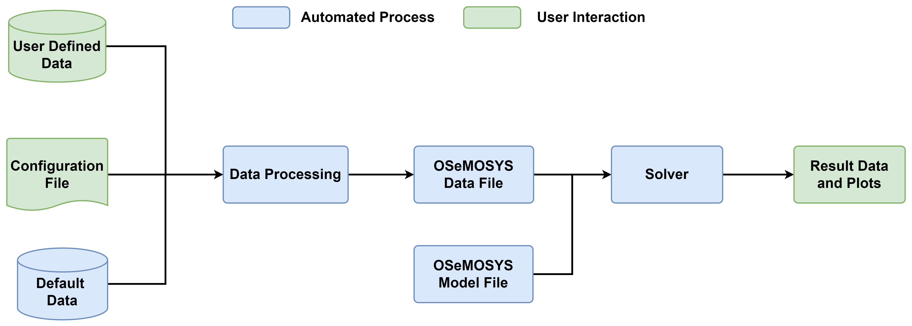

# Getting Started

This page gives an overview of OSeMOSYS Global's workflow and the configuration options available to the user. It assumes the reader has successfully followed the [installation instructions](installation.md). 

## Project Overview

OSeMOSYS Global is an open-source, open-data model generator for creating user-configurable electricity system models. This includes creating interconnected models for both the entire globe and for any geographically diverse subset of the globe. To manage the data pipeline we use the workflow management tool [`snakemake`](https://snakemake.readthedocs.io/en/stable/). A high-level overview of OSeMOSYS Global's `snakemake` workflow is shown below. The green boxes highlight where the user interfaces with the model, while the blue boxes highlight automated actions that run behind the scenes.




## Directory Structure 

Upon cloning OSeMOSYS Global, the directory will look similar to tree structure shown below. Highlighted are the directories where the user is expected to interface with OSeMOSYS Global. Specifically, `config/config.yaml` holds general configuration options, `resources/custom_nodes/` holds data that the user can update to calibrate models or perform more indepth scenario analysis, finally, `results/<scenario>/` will hold all result data from a scenario run. Each of these sectors is described in detail below. 

```bash
osemosys_global
├── docs/                      
├── config/           
│   ├── config.yaml     # General configuration options 
├── resources/       
│   ├── custom_nodes/   # User defined data 
├── results/            # Appears after running 
│   ├── scenario_name/  # Holds model data for your scenario
├── workflow/                         
└── ...
```

## Configuration File

OSeMOSYS Global is a configurable model generator, allowing for full user flexibility in determining the time slice structure and geographic scope of the model and datasets. These configuration options are stored in the [`config/config.yaml` file](https://github.com/OSeMOSYS/osemosys_global/tree/master/config). An overview of the configuration file options are given below.

### Top Level Options
Top level options include parameters that do not directly modify the underlying model data. 

```{eval-rst}
.. csv-table::
   :header-rows: 1
   :widths: 16,16,16,16,16
   :file: config_tables/top_level.csv
```

### Temporal Options
OSeMOSYS Global's temporal structure uses a representative day approach. The minimum resolution is representing each year as a single timeslice. The maximum resolution is representing each month as an averaged 24hr day (ie. 12x24=288 timeslices). The temporal scope is between `2015` and `2100`.

```{eval-rst}
.. csv-table::
   :header-rows: 1
   :widths: 16,16,16,16,16
   :file: config_tables/temporal.csv
```

### Spatial Options
OSeMOSYS Global can natively model 164 countries seperated by 265 nodes. Users can select choose to model the entire global, or any number of countries within the world. Furthermore, functionality exists to add/remove to/from the default spatial resolution. 

```{eval-rst}
.. csv-table::
   :header-rows: 1
   :widths: 16,16,16,16,16
   :file: config_tables/spatial.csv
```

### Generator Options
OSeMOSYS Global will automatically aggregate and ingest geo-located powerplants from global datasets, including associated techno-economic parameters. Options to add to this compiled dataset can eaisly be done. Furthermore, modelling assumptions, such as reserve margins, can be modified through the configuration file. 

```{eval-rst}
.. csv-table::
   :header-rows: 1
   :widths: 16,16,16,16,16
   :file: config_tables/generators.csv
```

### Transmission Options
OSeMOSYS Global interfaces with the [Gloabl Transmission Database](https://www.sciencedirect.com/science/article/pii/S2352340924003895?dgcid=rss_sd_all) to ingest exising and planned transmission lines. Users can add to this dataset and modify assumptions applied to transmission lines. 

```{eval-rst}
.. csv-table::
   :header-rows: 1
   :widths: 16,16,16,16,16
   :file: config_tables/generators.csv
```

### Storage Options
OSeMOSYS Global interfaces with the [DOE Gloabl Energy Storage Database](https://gesdb.sandia.gov/) to ingest exising and planned storage units. Users can add to this dataset and modify assumptions applied to storage units. 

```{eval-rst}
.. csv-table::
   :header-rows: 1
   :widths: 16,16,16,16,16
   :file: config_tables/storage.csv
```

### Policy Options
A core function of energy planning models is expoloring the impacts of different policy. This section describes the configuration options available to model different policies. 

```{eval-rst}
.. csv-table::
   :header-rows: 1
   :widths: 16,16,16,16,16
   :file: config_tables/policies.csv
```

## Units

testing

