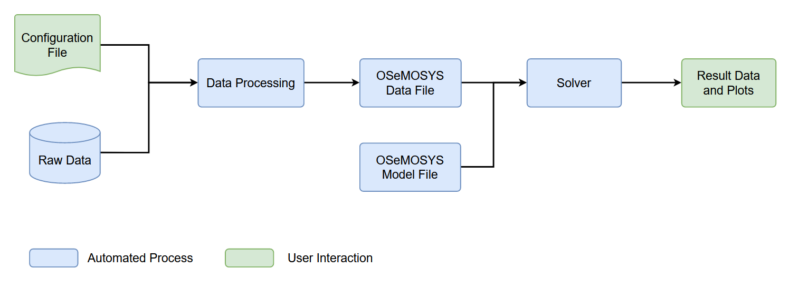

# Getting Started

This page will give you an overview of OSeMOSYS Globals workflow, and walk through some simple examples of creating models. 

## Project Overview

OSeMOSYS Global uses the workflow management system, [Snakemake](https://snakemake.readthedocs.io/en/stable/) to create a configurable workflow. A high level overview of OSeMOSYS Global workflow is shown below. The green boxes highlight where the user interfaces with the model, while the blude boxes highlight automated actions that run behind the scenes.



The main components of the directory that the user will interface with are
highlighted below. This directory structure follows the recommended [snakemake structure](https://snakemake.readthedocs.io/en/stable/snakefiles/deployment.html).

``` bash
osemosys_global
├── docs                      
├── config                      # User configurable setup files
│   ├── config.yaml             
├── resources                    
├── resutls                     # Will appear after running 
│   ├── data                    
│   ├── figs                    # Global demand projection figures 
│   ├── scenario_name           # Repeted folder for each scenario run
│   │   ├── data/               # Scenario input CSV data
│   │   ├── figures/            # Scenario result figures
│   │   ├── results/            # Scenario result CSV data
│   │   ├── scenario_name.txt   # Scenario data file
├── workflow                         
└── ...
```

### Configuration File

Numerous parameters have been exposed to the user to control the model. These
parameters are stored in the [configuration file](https://github.com/OSeMOSYS/osemosys_global/tree/master/config). An overview of the configuration options are shown below:

```{include} ../config/README.md
```

:::{seealso}
Our [naming conventions](./naming-conventions.md) document for full detials on model nomenclature
:::

## Examples

### Example One

**Goal**: Run the Workflow with Default Settings. This will produce a model of India from 
2020 to 2050. 

1. Run the command `snakemake -c`

    ```bash
    (osemosys-global) ~/osemosys_global$ snakemake -c
    ```

2. View system level results in the `results/India/figures` folder

### Example Two

**Goal**: Modify Geographic Scope and Emission Penalty

The goal of this scenario will be to change the geographic scope to include Bangladesh, Bhutan, India, and Nepal (BBIN). Moreover, trade will be allowed and an emission penalty of $25/Tonne is added. 

:::{note}
All changes described below occur in the `config/config.yaml` file
:::

1. Change the scenario name

    ```bash
    scenario: 'BBIN'
    ```

2. Change the geographic scope

    ```bash
    geographic_scope:
    - 'IND'
    - 'BGD'
    - 'BTN'
    - 'NPL'
    ```

3. Update the `crossborderTrade` parameter

    ```bash
    crossborderTrade: True
    ```

4. Change the emission penalty

    ```bash
    emission_penalty: 25 
    ```

5. Run the command `snakemake -c`

    ```bash
    (osemosys-global) ~/osemosys_global$ snakemake -c
    ```

    :::{warning}
    If you run into any issues with the workflow, run the command `snakemake clean -c`. This will delete any auto generated files and bring you back to a clean start. 
    :::

6. View system level and country results in the `results/BBIN/figures` folder

### Example 3

**Goal**: Run a World Example

The goal of this scenario is to run a World scenario from 2020 to 2040 graphing results at a system level only

:::{note}
All changes described below occur in the `config/config.yaml` file
:::

1. Change the scenario name

    ```bash
    scenario: 'WORLD'
    ```

2. Delete everything under the geographic scope

    ```bash
    geographic_scope:
    ```

    :::{note}
    Do **NOT** delete the `geographic_scope:` keyword
    :::

3. Change the startYear and endYear parameters

    ```bash
    startYear: 2020
    endYear: 2040
    ```

4. Set the results to only graph at a system level

    ```bash
    results_by_country: False
    ```

5. Run the command `snakemake -c` 

    :::{warning}
    This scenario will take multiple hours using a commercial solver (Gurobi or CPLEX) on a 
    high performance computer
    :::

    ```bash
    (osemosys-global) ~/osemosys_global$ snakemake -c
    ```

6. View system level results in the `results/WORLD/figures` folder

## Feedback

If you are experienceing issues running any of the examples, please submit a [new issue](https://github.com/OSeMOSYS/osemosys_global/issues/new/choose) on the GitHub. 

:::{seealso}
Our GitHub [discussion fourm](https://github.com/OSeMOSYS/osemosys_global/discussions) is a great place to ask general OSeMOSYS Global questions. OSeMOSYS' [Google Group](https://groups.google.com/g/osemosys) is a good place to ask questions about the OSeMOSYS framework.   
:::