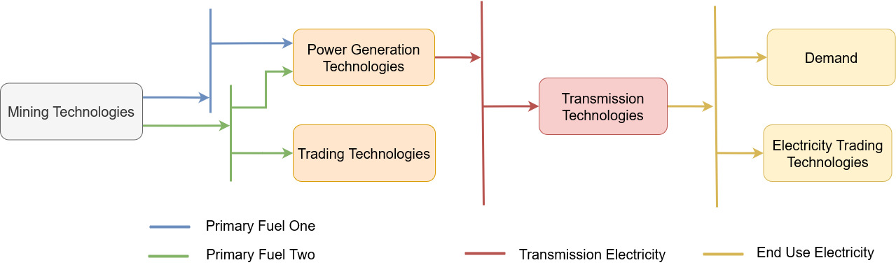
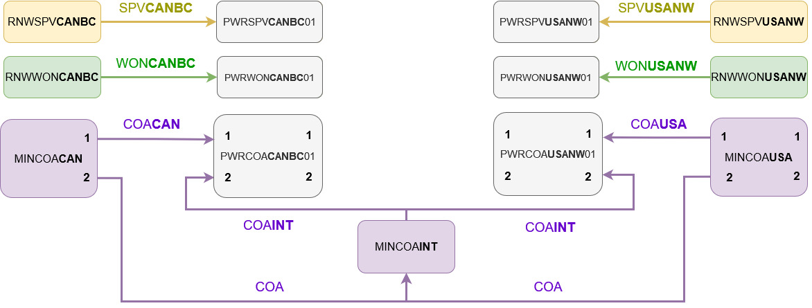
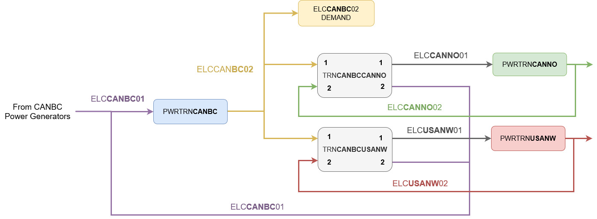

# Naming Conventions

This page describes the detials of the naming conventions used in OSeMOSYS 
Global. This is a helpful resource for when modifying the configuration file 
or interpreting the results. 

## Reference Energy System

The schematic below shows a high level overview of the reference energy system 
(RES). OSeMOSYS models are built through connecting commodities (ie. fules) and 
energy conversion technologies. In OSeMOSYS Global, each technology and 
commidity has a unique identifier based on it purpose (mining, transmission, 
ect..), its type (hydropower, solar power, ect...), and/or its location 
(country and regional node.) 

:::{seealso}
A full RES example for a single node can be found [here](#full-example)
:::

:::{seealso}
OSeMOSYS' 
[documentation](https://osemosys.readthedocs.io/en/latest/manual/Create%20a%20model%20in%20OSeMOSYS.html#mapping-the-res-of-atlantis) 
on Reference Energy Systems
:::

## OSeMOSYS Global Structure

. This page will walk through how OSeMOSYS 
Global connects and names each technology and commodity. 

### Spatial Codes

#### Country Codes 

OSeMOSYS Global can model a total of **163 countries**. All countries are 
described using their three letter codes, which can be found 
[here](https://en.wikipedia.org/wiki/ISO_3166-1_alpha-3). A few 
examples are given in the table below

| Country           | Code |
|-------------------|------|
| Netherlands       | NLD  |
| Great Britain     | GBR  |
| Canada            | CAN  |
| India             | IND  |

#### Regional Node Codes

Some countries are further divided into regional nodes, for a total of **265 
nodes**. These nodes are represented by adding 2 characters to the country 
codes. If a country is represented by a single note, a XX placeholder is added. 

| Character Example | Location | Length | Description        |
|-------------------|----------|--------|--------------------|
| X X X _ _         | (01-03)  | 5      | Country Code       |
| _ _ _ X X         | (04-05)  | 5      | Regional Node Code |

Examples of spatial codes are given below

| Country         | Node              | Code   |
|-----------------|-------------------|--------|
| United States   | California        | USACA  |
| Canada          | British Columbia  | CANBC  |
| Bangladash      | n/a               | BGDXX  |

### Acronyms 

Each unique technology and commodity in OSeMOSYS Global has a three-character
code used to identify it. These three letter codes are not directly modelled, 
instead they are used to build the full technologies and commodity codes used
in OSeMOSYS Global. 

#### Technology Acronyms

Thirteen power generation technologies are modelled in OSeMOSYS Global. The 
acronyms used to identify each technology are given below. 

| Technology                 | Code |
|----------------------------|------|
| Biomass                    | BIO  |
| Combined Cycle Natural Gas | CCG  |
| Coal                       | COA  |
| Cogeneration               | COG  |
| Concentrated Solar Power   | CSP  |
| Geothermal                 | GEO  |
| Hydroelectric              | HYD  |
| Open Cycle Natural Gas     | OCG  |
| Oil                        | OIL  |
| Other                      | OTH  |
| Petroleum                  | PET  |
| Solar Photovoltaic         | SPV  |
| Nuclear                    | URN  |
| Wave                       | WAV  |
| Waste                      | WAS  |
| Offshore Wind              | WOF  |
| Onshore Wind               | WON  |

#### Commodity Acronyms

Each of the power generation technologies operate on a given commodity. The 
acronyms used to identify these commodities are given in the table below. Note, 
that some technologies share commodities, such as Combined Cycle Natural Gas 
and Open Cycle Natural Gas both operating on the commodity GAS. 

| Commodity                  | Code |
|----------------------------|------|
| Biomass                    | BIO  |
| Natural Gas                | GAS  |
| Coal                       | COA  |
| Geothermal                 | GEO  |
| Hydro                      | HYD  |
| Oil                        | OIL  |
| Other                      | OTH  |
| Petroleum                  | PET  |
| Solar                      | SPV  |
| Nuclear                    | URN  |
| Wave                       | WAV  |
| Waste                      | WAS  |
| Offshore Wind              | WOF  |
| Onshore Wind               | WON  |

### Technology Codes

Technologies are responsible for converting one energy carrier into another. 
Each technology can have unique costs, efficiencies, and capacity/generation 
limits. There are four types of technologies in OSeMOSYS Global; mining 
technologies, power generation technoloiges, trasmission technologies, and 
trade technologies. 

#### Mining Technology Codes

Mining technologies are responsible for introducing raw commodities into the 
model. These technologies are either 9 or 11 characters long, depending on 
the type of resource the technology mines. Technologies that introduce 
non-tradable renewable resources into the model are 11 characters long, while 
technologies that introduce tradable commodities are 9 letters long. The
difference comes from renewable resources being tracked at a **nodal** level, 
while physical resources being tracked at a **country** level.

| Character Example         | Location | Length | Description |
|---------------------------|----------|--------|-------------|
| M I N _ _ _ _ _ _ _ _     | (01-03)  | 11     | Mining tradable commodity |
| R N W _ _ _ _ _ _         | (01-03)  | 9      | Mining non-tradable commodity |
| _ _ _ X X X _ _ _ ( _ _ ) | (04-06)  | 9 / 11 | Technology code |
| _ _ _ _ _ _ X X X ( _ _ ) | (07-09)  | 9 / 11 | Country code or `INT` for International* |
| R N W _ _ _ _ _ _ X X     | (10-11)  | 11     | Regional node code |

(*) See trading technologies for more information

Examples of mining technologies are given in the table below

| Code        | Description |
|-------------|------|
| MINGASCAN   |   |
| MINGASINT   |   |
| RNWWNSCANBC |   |

#### Power Generation Technology Codes

Power generation technologies are responsible for converting raw commodities
into electricity transmission commodities. These technologies are 13 
characters long and include spatial and technology identifiers. The makeup of 
these codes are given in the table below. 

| Character Example         | Location | Length | Description |
|---------------------------|----------|--------|-------------|
| P W R _ _ _ _ _ _ _ _ _ _ | (01-03)  | 13     | Power generator |
| _ _ _ X X X _ _ _ _ _ _ _ | (04-06)  | 13     | Technology code |
| _ _ _ _ _ _ X X X _ _ _ _ | (07-09)  | 13     | Country code |
| _ _ _ _ _ _ _ _ _ X X _ _ | (10-11)  | 13     | Regional node code |
| _ _ _ _ _ _ _ _ _ _ _ 0 0 | (12-13)  | 13     | Technology that can **not** be invested in |
| _ _ _ _ _ _ _ _ _ _ _ 0 1 | (12-13)  | 13     | Technology that **can** be invested in |

All power generation technologies will at minimum be represented with a `01` 
at the end of the code, signifying the technology can be invested in (if the 
total max capacity limits allow it). Only some technologies will also be 
represented by coes that end with a `00`. These will represent historical 
technologies that exist at the start of the model but can no longer be invested
in, such as thermal generators built a number of years ago with poor 
efficiencies. 

Examples of power generation technologies are given in the table below

| Code          | Description |
|---------------|-------------|
| PWRURNCANBC01 |   |
| PWROCGINDNE00 |   |
| PWRSPVUSACA01 |   |

#### Transmission Technology Codes

Transmission technologies are responsible for coverting a regional node's 
transmission electricity into end use electricity, and recieving traded 
electricity. It acts as a dummy aggregation technology. The makeup of this 
code is given in the table below. 

| Character Example     | Location | Length | Description |
|-----------------------|----------|--------|-------------|
| P W R _ _ _ _ _ _ _ _ | (01-03)  | 11     | Power generator |
| _ _ _ T R N _ _ _ _ _ | (04-06)  | 11     | Transmission technology |
| _ _ _ _ _ _ X X X _ _ | (07-09)  | 11     | Country code |
| _ _ _ _ _ _ _ _ _ X X | (10-11)  | 11     | Regional node code |

Example transmisison technologies are given below. 

| Code        | Description |
|-------------|-------------|
| PWRTRNCANBC |   |
| PWRTRNINDNE |   |
| PWRTRNUSACA |   |

#### Trading Technology Codes

:::{seealso}
Our description of how resource trading functions in OSeMOSYS Global
:::

Trading technologies are responsible for trading electricity. While physical 
commodities can also be traded, these are handeled through trading internationl
fules. Trading technologies connect from one nodes end use electricity to another 
nodes transmission electricity. The table below summarises the codes. 

| Character Example         | Location | Length | Description |
|---------------------------|----------|--------|-------------|
| T R N _ _ _ _ _ _ _ _ _ _ | (01-03)  | 13     | Transmission technology |
| _ _ _ X X X _ _ _ _ _ _ _ | (04-06)  | 13     | Country to trade **from** |
| _ _ _ _ _ _ X X _ _ _ _ _ | (07-09)  | 13     | Regional node to trade **from** |
| _ _ _ _ _ _ _ _ X X X _ _ | (10-11)  | 13     | Country to trade **to** |
| _ _ _ _ _ _ _ _ _ _ _ X X | (12-13)  | 13     | Regional node to trade **to** |

### Commodity Codes 

Commodities (or fuel) carry energy and flow into and out of technologies in OSeMOSYS. 
There are three classifications of commodities in OSeMOSYS Global, primary fuel, 
transmission level fuel, and end use fuel. 

#### Raw Fuel Codes

Raw fules in OSeMOSYS Global can be three, six, or eight characters long.
Depending on the fuels purpose, the country and/or region may or may not need 
to be tracked. The different raw fuel codes are summarized below

| Character Example   | Location | Length    | Description |
|---------------------|----------|-----------|-------------|
| X X X ( _ _ _ _ _ ) | (01-03)  | 3 / 6 / 8 | Commodity code |
| _ _ _ X X X ( _ _ ) | (04-06)  | 6 / 8     | Country code or `INT` for International* |
| _ _ _ _ _ _ X X     | (07-08)  | 8         | Regional node code |

(*) See trading technologies for more information

Examples of primary fuels are given below

| Code     | Description |
|----------|-------------|
| GAS      |   |
| URNINT   |   |
| URNCAN   |   |
| WNDCANBC |   |

#### Transmission Fuel Codes

Transmission level fuel will carry energy from the primary power generation
technologies to the transmission technologies. All transmission level fuels
follow the same 10 character naming convention. 

| Character Example   | Location | Length  | Description |
|---------------------|----------|---------|-------------|
| E L C _ _ _ _ _ _ _ | (01-03)  | 10      | Electricity |
| _ _ _ X X X _ _ _ _ | (04-06)  | 10      | Country code |
| _ _ _ _ _ _ X X _ _ | (07-08)  | 10      | Regional node code |
| _ _ _ _ _ _ _ _ 0 1 | (09-10)  | 10      | Transmission Level |

Examples of transmission fuels are given below

| Code       | Description |
|------------|-------------|
| ELCCANBC01 |   |
| ELCINDNE01 |   |

#### End Use Fuel Codes

End use fuel will carry energy from the transmssion technology to demands or 
to trading technologies. All end use fules follow the same 10 character naming 
convention. 

| Character Example   | Location | Length  | Description |
|---------------------|----------|---------|-------------|
| E L C _ _ _ _ _ _ _ | (01-03)  | 10      | Electricity |
| _ _ _ X X X _ _ _ _ | (04-06)  | 10      | Country code |
| _ _ _ _ _ _ X X _ _ | (07-08)  | 10      | Regional node code |
| _ _ _ _ _ _ _ _ 0 2 | (09-10)  | 10      | End Use |

Examples of transmission fuels are given below

| Code       | Description |
|------------|-------------|
| ELCCANBC02 |   |
| ELCINDNE02 |   |

## Commodity Trading 

This section will provide further detial on how commodity trading functions in 
OSeMOSYS Global. 

### Primary Fuel Trading

Two primary fuel types exist in OSeMOSYS Global; fule that can and can not 
be traded. Primary fuel that can not be traded may be due to it being a natural 
resource (such as wind and solar) or due to geographic restrictions (such as 
hydro). Fuel that can be traded include physical goods (such as coal and 
uranium). The table below breaks down which fuels fall into which categories.

| Commodity                  | Tradable |
|----------------------------|----------|
| Biomass                    | No       |
| Natural Gas                | Yes      |
| Coal                       | Yes      |
| Geothermal                 | No       |
| Hydro                      | No       |
| Oil                        | Yes      |
| Other                      | Yes      |
| Petroleum                  | Yes      |
| Solar                      | No       |
| Nuclear                    | Yes      |
| Wave                       | No       |
| Waste                      | No       |
| Offshore Wind              | No       |
| Onshore Wind               | No       |

Fuel which can **not** be traded is mined by nodal mining technologies and 
flows directly into its repective nodal power generator. For example, wind and 
solar resources. Fuel which can be traded can flow into an interational 
trading technology, or any nodal power generation technology within the country. 
A small example of these options are shown below for British Columbia, Canada 
and the North West, USA for the fuels solar, onshore wind, and coal. 

### End Use Fuel Trading

Much like with primary fules, end use fuels can also be traded. However, end
use fuel can only be traded to adjacent nodes, rather then on the international
market and regions abroad. End use fuel trading is managed through desgnated 
electrical trading technologies. An example of how end use trading works is 
shown below for British Columbia, Canada, and two of its adjacent regions, the 
North West, USA and Albera / North West Territories, Canada. 

## Full Example

The schematic below shows the full reference energy system for the node of 
British Columbia, Canada. All nodes follow the similar structure. 

